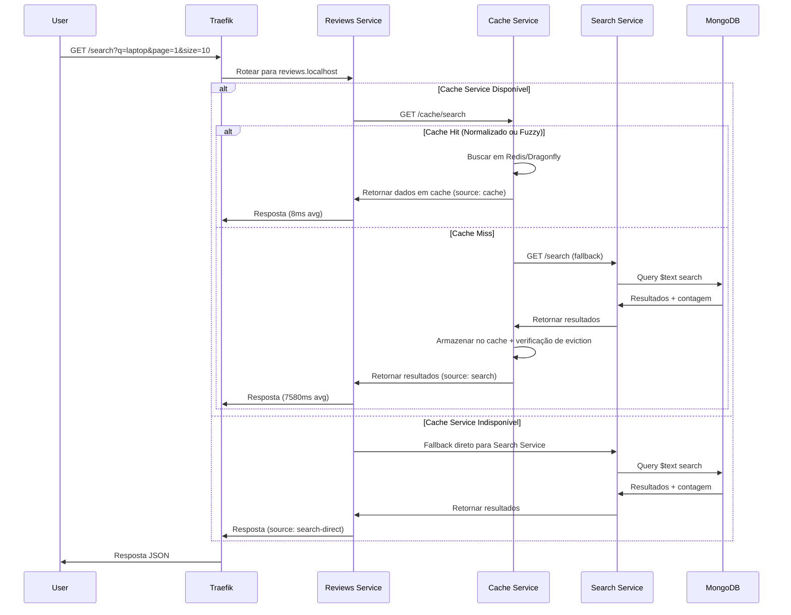
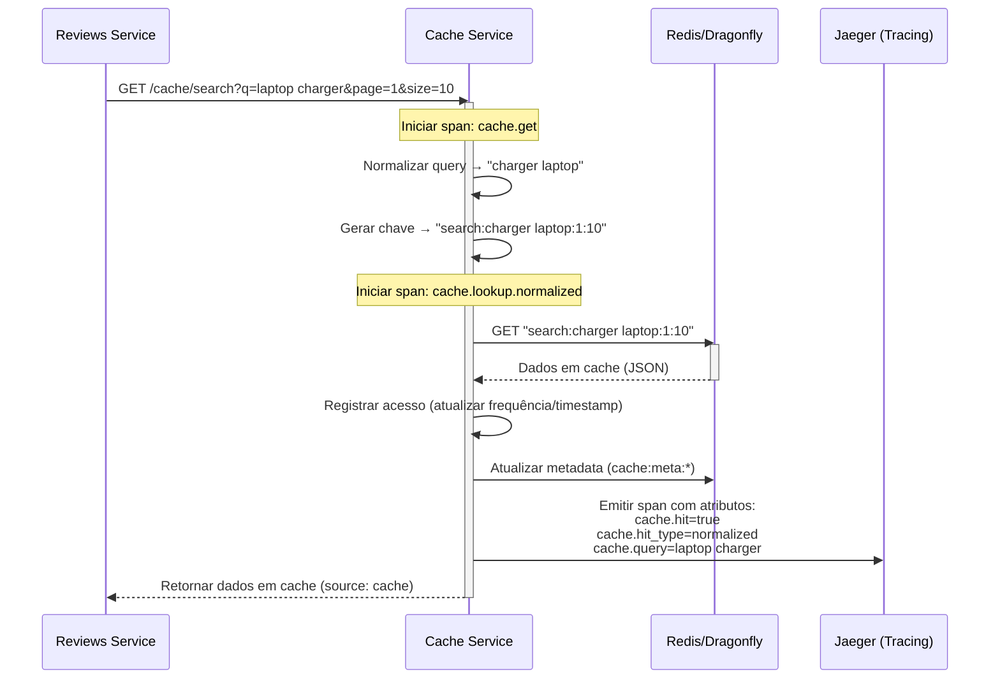
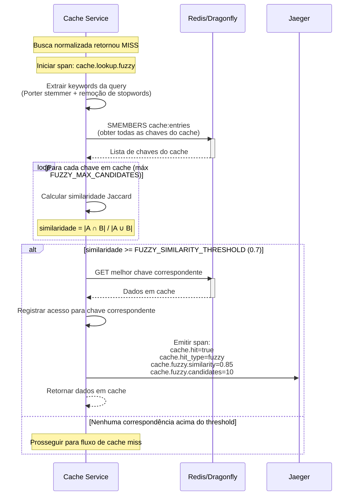
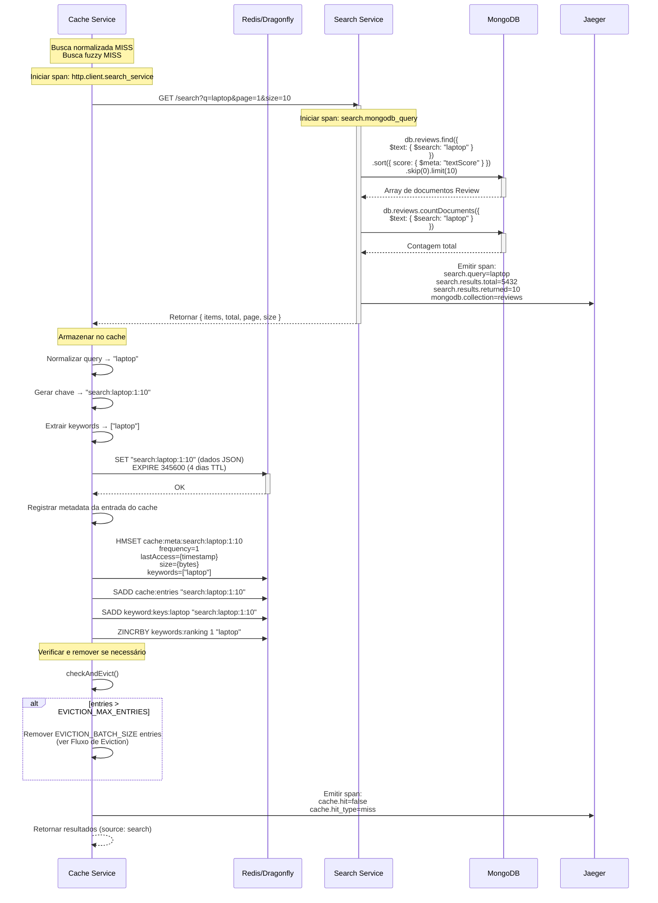
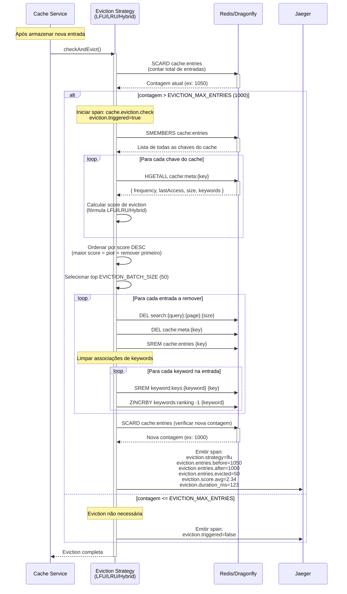
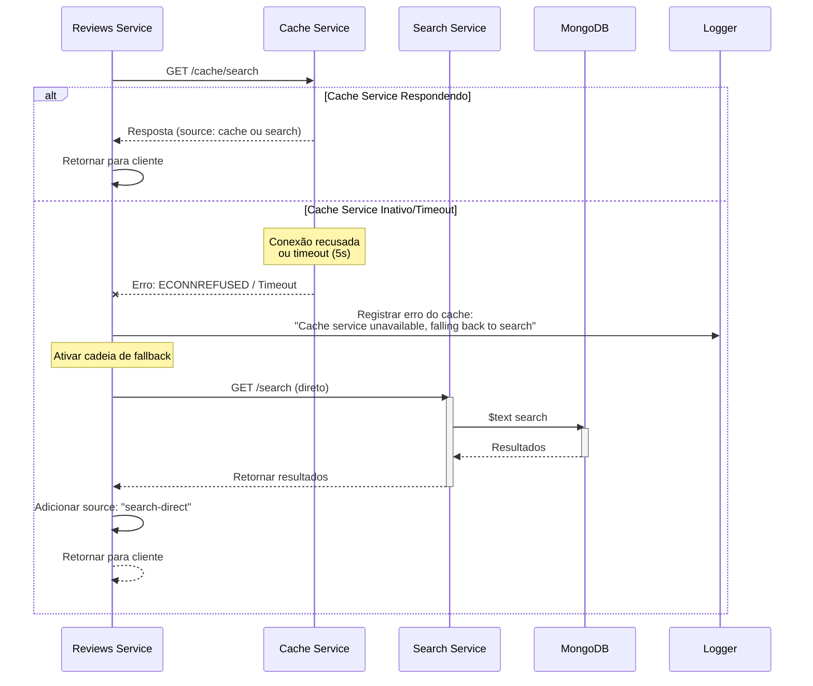

# Data Flow Patterns

## Table of Contents
- [Overview](#overview)
- [Request Lifecycle](#request-lifecycle)
- [Cache Hit Flow](#cache-hit-flow)
- [Cache Miss Flow](#cache-miss-flow)
- [Fuzzy Matching Flow](#fuzzy-matching-flow)
- [Eviction Flow](#eviction-flow)
- [Fallback Flow](#fallback-flow)
- [Performance Metrics](#performance-metrics)

## Overview

This document details the data flow patterns in the DAAP system, focusing on request routing, caching mechanisms, and fallback strategies. Understanding these flows is critical for troubleshooting and optimization.

## Request Lifecycle

Every search request follows this general pattern:



### Response Structure

All search responses follow this format:

```typescript
interface SearchResult {
  items: Review[];      // Array of review documents
  total: number;        // Total matching documents
  page: number;         // Current page (pagination)
  size: number;         // Page size
  source: 'cache' | 'search' | 'search-direct';  // Data source indicator
}
```

**Source Indicators**:
- `cache`: Data retrieved from Cache Service (8ms avg)
- `search`: Cache miss, fetched from Search Service via Cache Service (7580ms avg)
- `search-direct`: Cache Service unavailable, direct fallback to Search Service

## Cache Hit Flow

### Normalized Cache Hit (60% of hits)

**Average Response Time**: 8ms



**Key Steps**:
1. **Query Normalization**: Alphabetically sort keywords
   - `"laptop charger"` → `"charger laptop"`
   - `"charger laptop"` → `"charger laptop"` (already normalized)
2. **Cache Key Generation**: `search:{normalized_query}:{page}:{size}`
3. **Lookup**: Direct Redis GET operation
4. **Access Recording**: Update metadata for eviction strategy
5. **Tracing**: Emit span with `cache.hit_type=normalized`

### Fuzzy Cache Hit (31% of hits)

**Average Response Time**: 10ms (includes fuzzy matching overhead)



**Fuzzy Matching Algorithm**:

1. **Keyword Extraction** (Porter Stemmer):
   ```typescript
   Query: "laptop charging cables"
   Keywords after stemming: ["laptop", "charg", "cabl"]
   ```

2. **Jaccard Similarity**:
   ```typescript
   Query keywords: ["laptop", "charg", "cabl"]
   Cached keywords: ["laptop", "usb", "charg"]

   Intersection: ["laptop", "charg"] → 2 elements
   Union: ["laptop", "charg", "cabl", "usb"] → 4 elements

   Similarity = 2/4 = 0.5 (below 0.7 threshold → MISS)
   ```

3. **Match Criteria**:
   - Similarity >= 0.7 (70% keyword overlap)
   - Maximum 10 candidates evaluated (FUZZY_MAX_CANDIDATES)

**Configuration** (`.env`):
```bash
ENABLE_FUZZY_CACHE=true
FUZZY_SIMILARITY_THRESHOLD=0.7
FUZZY_MAX_CANDIDATES=10
```

## Cache Miss Flow

**Average Response Time**: 7580ms



### Cache Entry Metadata

Every cache entry stores metadata for eviction:

```typescript
interface CacheEntryMetadata {
  frequency: number;      // Access count (for LFU)
  lastAccess: number;     // Unix timestamp (for LRU)
  size: number;           // Bytes (for capacity planning)
  keywords: string[];     // Extracted keywords
}
```

**Redis Storage**:
```
HMSET cache:meta:search:laptop:1:10
  frequency 42
  lastAccess 1730468400000
  size 15234
  keywords ["laptop"]
```

## Fuzzy Matching Flow

Detailed view of the fuzzy matching algorithm:

```mermaid
flowchart TD
    Start([Busca Normalizada MISS]) --> Extract[Extrair Keywords<br/>Porter Stemmer + Remoção de Stopwords]

    Extract --> GetEntries[Obter Todas as Entradas do Cache<br/>SMEMBERS cache:entries]

    GetEntries --> Loop{Para cada<br/>entrada em cache}

    Loop -->|Sim| GetKeywords[Obter Keywords da Entrada<br/>de cache:meta:*]

    GetKeywords --> CalcSim[Calcular Similaridade Jaccard<br/>|A ∩ B| / |A ∪ B|]

    CalcSim --> CheckMax{Candidatos <br/>< MAX?}

    CheckMax -->|Sim| StoreSim[Armazenar score de similaridade]
    CheckMax -->|Não| SkipEntry[Pular entrada]

    StoreSim --> Loop
    SkipEntry --> Loop

    Loop -->|Sem mais entradas| Sort[Ordenar por similaridade DESC]

    Sort --> CheckBest{Melhor score<br/>>= 0.7?}

    CheckBest -->|Sim| Hit[Fuzzy Cache Hit<br/>Retornar dados em cache]
    CheckBest -->|Não| Miss[Cache Miss<br/>Buscar do MongoDB]

    Hit --> RecordAccess[Registrar Acesso<br/>Atualizar metadata]
    RecordAccess --> Trace[Emitir Trace Span<br/>cache.hit_type=fuzzy<br/>cache.fuzzy.similarity]

    Miss --> FetchData[Prosseguir para Fluxo de Cache Miss]

    Trace --> End([Retornar para Cliente])
    FetchData --> End

    style Start fill:#e1f5ff
    style Hit fill:#e1ffe1
    style Miss fill:#ffe1e1
    style End fill:#f4e1ff
```

### Fuzzy Matching Example

**Scenario**: User searches for `"laptop charging cable"`

**Step 1**: Normalize and extract keywords
```
Original: "laptop charging cable"
Stemmed: ["laptop", "charg", "cabl"]
```

**Step 2**: Compare with cached entries

| Cached Query | Cached Keywords | Intersection | Union | Similarity | Match? |
|--------------|-----------------|--------------|-------|------------|--------|
| `"laptop charger"` | `["laptop", "charg"]` | 2 | 3 | **0.67** | No (< 0.7) |
| `"laptop usb charger"` | `["laptop", "usb", "charg"]` | 2 | 4 | **0.50** | No |
| `"laptop charging accessories"` | `["laptop", "charg", "accessori"]` | 2 | 4 | **0.50** | No |
| `"laptop power cable charger"` | `["laptop", "power", "cabl", "charg"]` | 3 | 4 | **0.75** | **Yes!** |

**Result**: Fuzzy match with `"laptop power cable charger"` (75% similarity)

**Performance Impact**:
- Normalized hit: ~3ms
- Fuzzy hit: ~10ms (+7ms overhead for similarity calculation)
- Still **99.9% faster** than MongoDB query (7580ms)

## Eviction Flow

Triggered automatically after every `.set()` operation:



### Eviction Score Formulas

#### LFU (Least Frequently Used)
```typescript
const timeSinceAccess = Date.now() - metadata.lastAccess;
const ageInHours = timeSinceAccess / (1000 * 60 * 60);
const score = (1 / (metadata.frequency + 1)) + (ageInHours * 0.1);
```

**Example**:
- Entry A: `freq=99, age=1h` → `score = 0.01 + 0.1 = 0.11` (keep)
- Entry B: `freq=1, age=24h` → `score = 0.5 + 2.4 = 2.9` (evict)

#### LRU (Least Recently Used)
```typescript
const timeSinceAccess = Date.now() - metadata.lastAccess;
const score = timeSinceAccess; // Milliseconds
```

**Example**:
- Entry A: `lastAccess=5 min ago` → `score = 300000` (keep)
- Entry B: `lastAccess=2 days ago` → `score = 172800000` (evict)

#### Hybrid (LFU + LRU)
```typescript
const frequencyScore = 1 / (metadata.frequency + 1);
const ageInHours = (Date.now() - metadata.lastAccess) / (1000 * 60 * 60);
const recencyScore = ageInHours * 0.1;

const score =
  (EVICTION_FREQUENCY_WEIGHT * frequencyScore) +
  (EVICTION_RECENCY_WEIGHT * recencyScore);
```

**Example** (weights: 60% freq, 40% recency):
- Entry A: `freq=50, age=2h` → `score = (0.6 * 0.0196) + (0.4 * 0.2) = 0.092` (keep)
- Entry B: `freq=5, age=48h` → `score = (0.6 * 0.167) + (0.4 * 4.8) = 2.02` (evict)

## Fallback Flow

Resilient fallback ensures availability even when Cache Service fails:



### Fallback Implementation

**Location**: [apps/reviews-service/src/modules/search/service.ts:32-51](../apps/reviews-service/src/modules/search/service.ts#L32-L51)

```typescript
async search(query: string, page: number, size: number): Promise<SearchResult> {
  try {
    // Primary path: Cache Service
    const response = await this.httpService.get(
      `${this.secretsService.CACHE_SERVICE_URL}/cache/search`,
      { params: { q: query, page, size }, timeout: 5000 }
    );
    return response.data;
  } catch (cacheError) {
    console.error('Cache service error, falling back to search service:', cacheError.message);

    // Fallback path: Search Service direct
    const response = await this.httpService.get(
      `${this.secretsService.SEARCH_SERVICE_URL}/search`,
      { params: { q: query, page, size } }
    );

    return { ...response.data, source: 'search-direct' };
  }
}
```

**Key Features**:
- 5-second timeout for Cache Service
- Automatic fallback on any error (connection, timeout, 5xx)
- Source indicator for monitoring

## Performance Metrics

### Response Time Comparison

| Scenario | Average Time | Improvement | Source |
|----------|--------------|-------------|--------|
| **Cache Hit (Normalized)** | 8ms | 99.9% faster | `cache` |
| **Cache Hit (Fuzzy)** | 10ms | 99.87% faster | `cache` |
| **Cache Miss** | 7580ms | Baseline | `search` |
| **Fallback (Direct)** | 7580ms | Baseline | `search-direct` |

### Cache Hit Rate (with fuzzy matching enabled)

| Component | Hit Rate |
|-----------|----------|
| Normalized Lookup | 60% |
| Fuzzy Matching | 31% |
| **Total Cache Hit Rate** | **91%** |
| Cache Miss | 9% |

### Impact of Fuzzy Matching

| Metric | Without Fuzzy | With Fuzzy | Delta |
|--------|---------------|------------|-------|
| Cache Hit Rate | 76% | 91% | **+35%** |
| Average Response Time | 1821ms | 730ms | **-60%** |
| MongoDB Queries | 24% | 9% | **-63%** |

### MongoDB Query Performance

**Full-text search breakdown**:
- `find()` operation: ~3800ms
- `countDocuments()` operation: ~3745ms
- **Total**: ~7545ms (plus network overhead)

**Why so slow?**:
- Text indexes scan large dataset
- Scoring calculation (`$meta: "textScore"`)
- No query result caching in MongoDB

## Next Steps

- [Network Topology](./03-network-topology.md) - Docker networking and service discovery
- [Cache Strategies](./04-cache-strategies.md) - Detailed eviction algorithm comparison
- [Observability](./05-observability.md) - Distributed tracing and metrics
