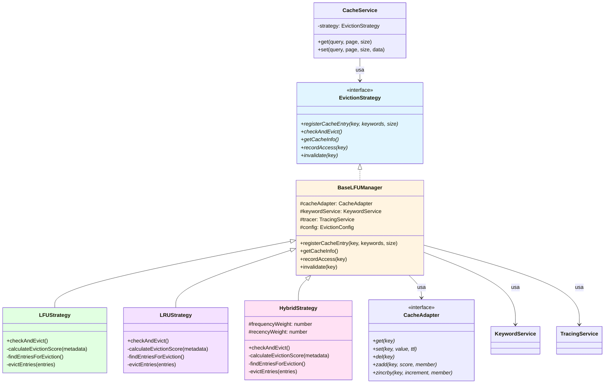
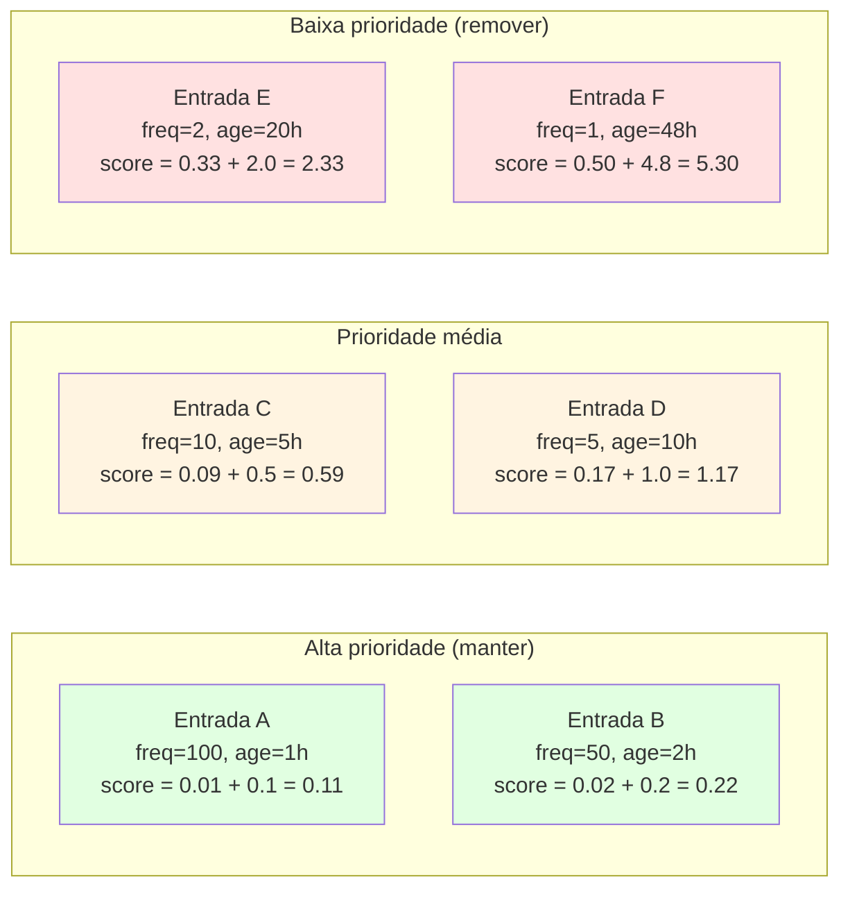
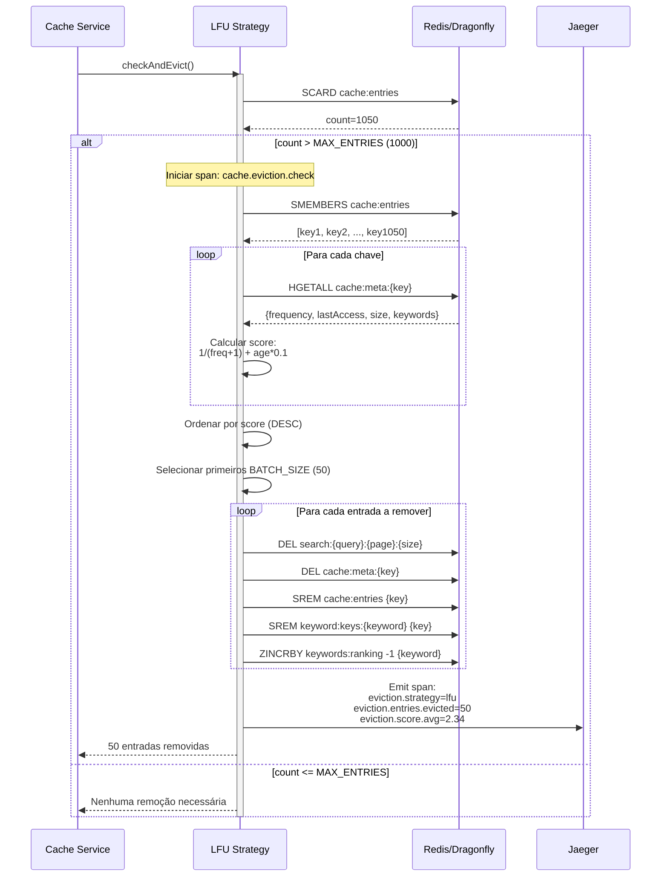
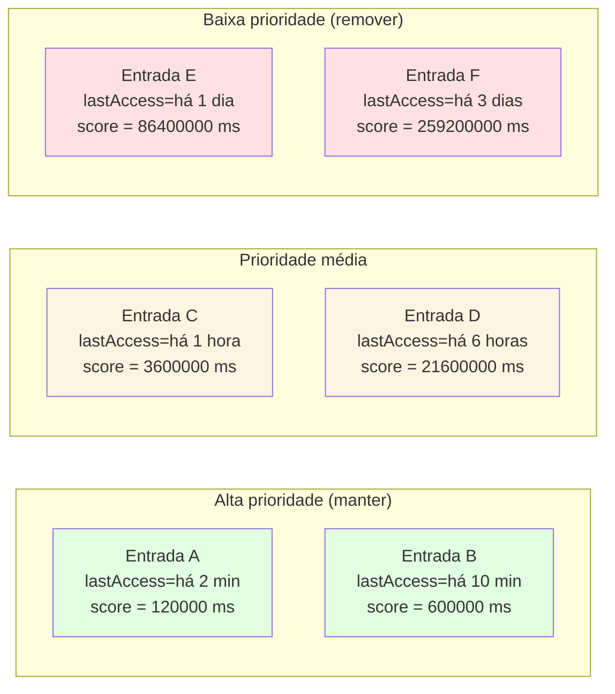
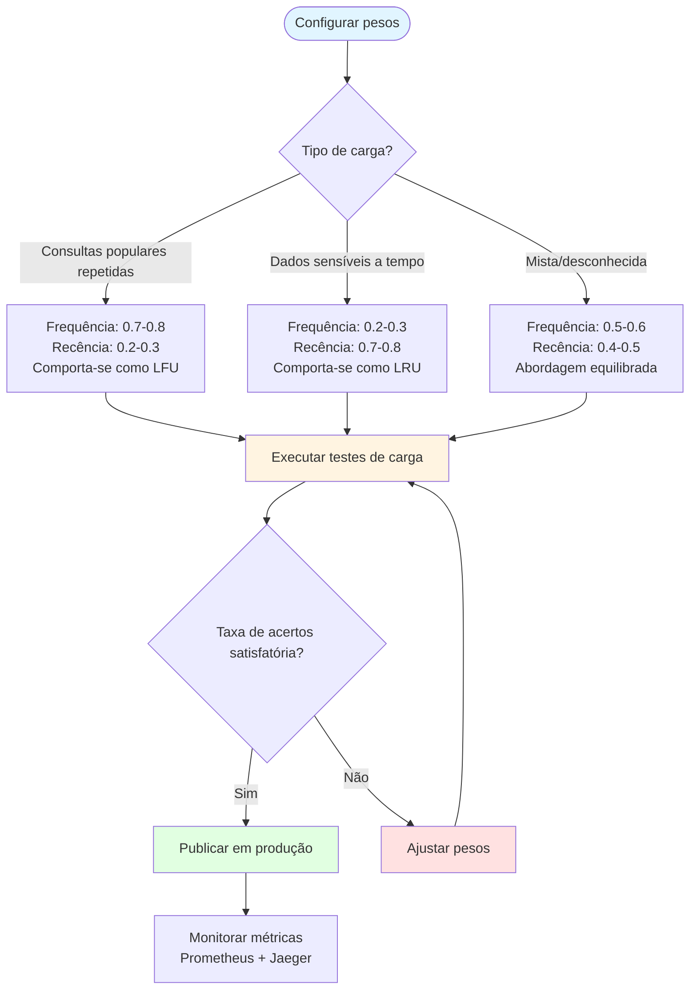
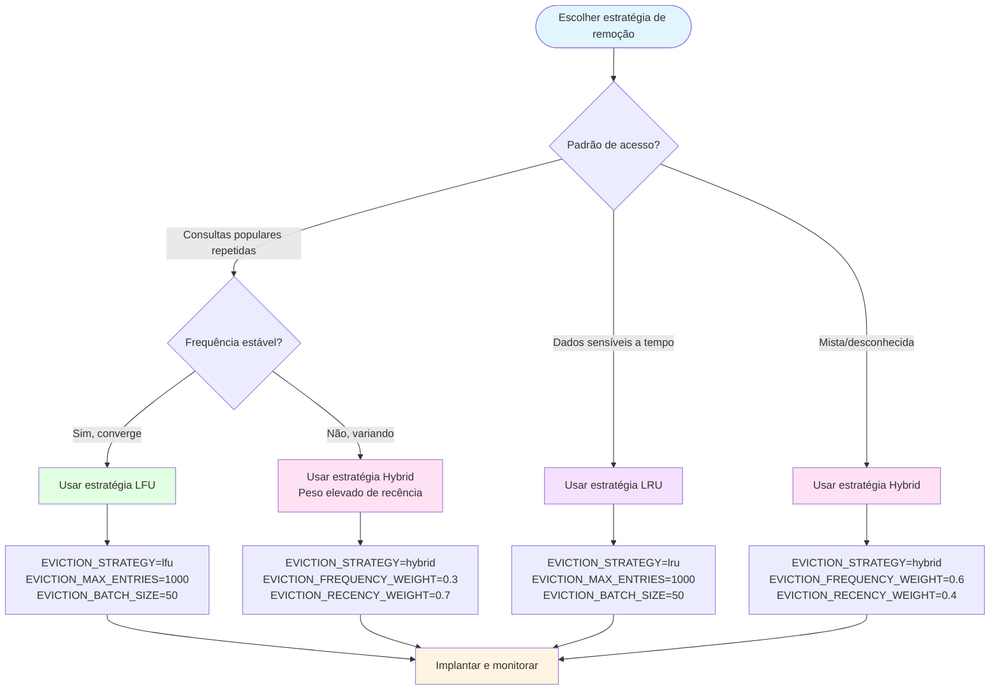
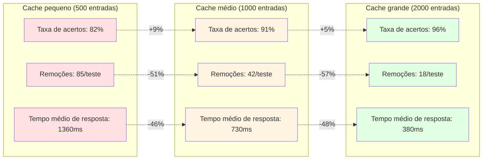

# Cache Eviction Strategies

## Table of Contents
- [Overview](#overview)
- [Strategy Architecture](#strategy-architecture)
- [LFU Strategy](#lfu-strategy-least-frequently-used)
- [LRU Strategy](#lru-strategy-least-recently-used)
- [Hybrid Strategy](#hybrid-strategy)
- [Strategy Comparison](#strategy-comparison)
- [Configuration Guide](#configuration-guide)
- [Performance Analysis](#performance-analysis)

## Overview

The DAAP cache system implements **three pluggable eviction strategies** that determine which cache entries to remove when the cache reaches capacity. Each strategy optimizes for different access patterns and use cases.

### Design Principle

All strategies implement a common interface, allowing **runtime switching via environment variables** without code changes:

```typescript
interface EvictionStrategy {
  registerCacheEntry(key: string, keywords: string[], size: number): Promise<void>;
  checkAndEvict(): Promise<void>;
  getCacheInfo(): Promise<CacheInfo>;
}
```

**Key Feature**: Pluggable architecture (Strategy Pattern)

## Strategy Architecture



### Strategy Selection

**Configuration** (`.env`):
```bash
EVICTION_STRATEGY=lfu  # Options: lfu, lru, hybrid
```

**Factory Pattern** ([cache/module.ts](../apps/cache-service/src/lib/cache/module.ts)):
```typescript
{
  provide: 'EVICTION_STRATEGY',
  useFactory: (
    adapter: CacheAdapter,
    keywordService: KeywordService,
    config: ConfigService,
  ) => {
    const strategy = config.get('EVICTION_STRATEGY', 'lfu');

    switch (strategy) {
      case 'lru':
        return new LRUStrategy(adapter, keywordService, config);
      case 'hybrid':
        return new HybridStrategy(adapter, keywordService, config);
      default:
        return new LFUStrategy(adapter, keywordService, config);
    }
  },
  inject: [CacheAdapter, KeywordService, ConfigService],
}
```

## LFU Strategy (Least Frequently Used)

**Principle**: Remove entries with the **lowest access frequency**, factoring in age.

**Best For**:
- Workloads with **popular repeated queries** (e.g., trending products)
- Long-running caches where frequency converges
- Scenarios where "hot" data should stay cached

### Eviction Score Formula

```typescript
const timeSinceAccess = Date.now() - metadata.lastAccess;
const ageInHours = timeSinceAccess / (1000 * 60 * 60);
const score = (1 / (metadata.frequency + 1)) + (ageInHours * 0.1);
```

**Logic**:
- **Higher score** = **worse** = evict first
- Frequency component: `1 / (freq + 1)` → low frequency = high score
- Age component: `age_hours * 0.1` → older entries get higher score
- Age is a tiebreaker when frequencies are similar

### Score Calculation Examples



### LFU Eviction Flow



### LFU Implementation

**Location**: [apps/cache-service/src/lib/cache/strategies/lfu.strategy.ts](../apps/cache-service/src/lib/cache/strategies/lfu.strategy.ts)

**Key Methods**:

```typescript
private calculateEvictionScore(metadata: CacheEntryMetadata): number {
  const timeSinceAccess = Date.now() - metadata.lastAccess;
  const ageInHours = timeSinceAccess / (1000 * 60 * 60);

  // Lower frequency + older age = higher score = worse = evict first
  return (1 / (metadata.frequency + 1)) + (ageInHours * 0.1);
}

private async findEntriesForEviction(): Promise<EvictionCandidate[]> {
  const allKeys = await this.cacheAdapter.smembers('cache:entries');
  const candidates: EvictionCandidate[] = [];

  for (const key of allKeys) {
    const metadata = await this.getCacheEntryMetadata(key);
    if (!metadata) continue;

    const score = this.calculateEvictionScore(metadata);
    candidates.push({ key, score, metadata });
  }

  // Sort DESC: highest score = worst = evict first
  candidates.sort((a, b) => b.score - a.score);

  return candidates.slice(0, this.config.EVICTION_BATCH_SIZE);
}
```

## LRU Strategy (Least Recently Used)

**Principle**: Remove entries that haven't been accessed for the **longest time**, ignoring frequency.

**Best For**:
- **Time-sensitive data** (news, stock prices)
- Workloads with **shifting patterns** (seasonal products)
- Scenarios where recency matters more than popularity

### Eviction Score Formula

```typescript
const timeSinceAccess = Date.now() - metadata.lastAccess;
const score = timeSinceAccess; // Milliseconds since last access
```

**Logic**:
- **Higher score** = **older** = evict first
- Frequency is **completely ignored**
- Pure time-based eviction

### Score Calculation Examples



### LRU vs LFU Comparison

**Scenario**: Two cache entries competing for eviction

| Entry | Frequency | Last Access | LFU Score | LRU Score | LFU Decision | LRU Decision |
|-------|-----------|-------------|-----------|-----------|--------------|--------------|
| **A** | 100 | 7 days ago | 0.01 + 168*0.1 = **16.81** | 604800000 | Evict | Evict |
| **B** | 1 | 1 hour ago | 0.50 + 1*0.1 = **0.60** | 3600000 | Keep | Keep |
| **C** | 50 | 3 days ago | 0.02 + 72*0.1 = **7.22** | 259200000 | Evict | Evict |
| **D** | 2 | 2 days ago | 0.33 + 48*0.1 = **5.13** | 172800000 | Evict | Keep (if B evicted) |

**Key Insight**: LRU evicts **D** before **B**, even though **B** has lower frequency, because **D** is older.

### LRU Implementation

**Location**: [apps/cache-service/src/lib/cache/strategies/lru.strategy.ts](../apps/cache-service/src/lib/cache/strategies/lru.strategy.ts)

```typescript
private calculateEvictionScore(metadata: CacheEntryMetadata): number {
  const timeSinceAccess = Date.now() - metadata.lastAccess;
  // Higher score = older = evict first
  return timeSinceAccess;
}
```

## Hybrid Strategy

**Principle**: **Weighted combination** of LFU and LRU, balancing frequency and recency.

**Best For**:
- **Mixed workloads** (popular + trending queries)
- General-purpose caching with no clear access pattern
- Tunable performance (adjust weights)

### Eviction Score Formula

```typescript
const frequencyScore = 1 / (metadata.frequency + 1);
const ageInHours = (Date.now() - metadata.lastAccess) / (1000 * 60 * 60);
const recencyScore = ageInHours * 0.1;

const score =
  (EVICTION_FREQUENCY_WEIGHT * frequencyScore) +
  (EVICTION_RECENCY_WEIGHT * recencyScore);
```

**Default Weights**:
- `EVICTION_FREQUENCY_WEIGHT = 0.6` (60% frequency)
- `EVICTION_RECENCY_WEIGHT = 0.4` (40% recency)

**Logic**:
- **Higher weight** on frequency → behaves more like LFU
- **Higher weight** on recency → behaves more like LRU
- Weights must sum to 1.0

### Weight Tuning



### Score Calculation Examples

**Weights**: 60% frequency, 40% recency

| Entry | Frequency | Age (hours) | Freq Score | Recency Score | **Hybrid Score** | Priority |
|-------|-----------|-------------|------------|---------------|------------------|----------|
| **A** | 100 | 1 | 0.0099 | 0.1 | 0.0099*0.6 + 0.1*0.4 = **0.046** | Keep |
| **B** | 50 | 6 | 0.0196 | 0.6 | 0.0196*0.6 + 0.6*0.4 = **0.252** | Keep |
| **C** | 10 | 24 | 0.0909 | 2.4 | 0.0909*0.6 + 2.4*0.4 = **1.015** | Medium |
| **D** | 5 | 48 | 0.1667 | 4.8 | 0.1667*0.6 + 4.8*0.4 = **2.020** | Evict |
| **E** | 1 | 72 | 0.5000 | 7.2 | 0.5000*0.6 + 7.2*0.4 = **3.180** | Evict |

### Hybrid Implementation

**Location**: [apps/cache-service/src/lib/cache/strategies/hybrid.strategy.ts](../apps/cache-service/src/lib/cache/strategies/hybrid.strategy.ts)

```typescript
export class HybridStrategy extends BaseLFUManager {
  private readonly frequencyWeight: number;
  private readonly recencyWeight: number;

  constructor(
    cacheAdapter: CacheAdapter,
    keywordService: KeywordService,
    config: ConfigService,
  ) {
    super(cacheAdapter, keywordService, config);

    this.frequencyWeight = parseFloat(config.get('EVICTION_FREQUENCY_WEIGHT', '0.6'));
    this.recencyWeight = parseFloat(config.get('EVICTION_RECENCY_WEIGHT', '0.4'));

    // Validate weights sum to 1.0
    if (Math.abs(this.frequencyWeight + this.recencyWeight - 1.0) > 0.001) {
      throw new Error('Frequency and recency weights must sum to 1.0');
    }
  }

  private calculateEvictionScore(metadata: CacheEntryMetadata): number {
    const frequencyScore = 1 / (metadata.frequency + 1);

    const timeSinceAccess = Date.now() - metadata.lastAccess;
    const ageInHours = timeSinceAccess / (1000 * 60 * 60);
    const recencyScore = ageInHours * 0.1;

    // Weighted combination
    return (this.frequencyWeight * frequencyScore) +
           (this.recencyWeight * recencyScore);
  }
}
```

## Strategy Comparison

### Decision Matrix



### Comparison Table

| Feature | LFU | LRU | Hybrid |
|---------|-----|-----|--------|
| **Primary Metric** | Access frequency | Last access time | Weighted combination |
| **Best For** | Popular repeated queries | Time-sensitive data | Mixed workloads |
| **Frequency Matters?** | Yes (primary) | No (ignored) | Yes (weighted) |
| **Recency Matters?** | Yes (tiebreaker) | Yes (primary) | Yes (weighted) |
| **Cache Hit Rate** | High for stable patterns | High for shifting patterns | Medium-high (balanced) |
| **Eviction Latency** | ~100-150ms | ~80-120ms | ~110-160ms |
| **Memory Overhead** | Medium | Low | Medium |
| **Tunable?** | No | No | **Yes** (weights) |
| **Cold Start** | Poor (frequency=0) | Good | Medium |
| **Long-Running** | Excellent | Poor (frequency lost) | Good |

### Performance Metrics (Sample Data)

**Test Setup**: 5000 requests, 10 concurrent, 1000 max entries

| Strategy | Total Evictions | Avg Duration (ms) | Entries/Eviction | Cache Hit Rate | Avg Response Time |
|----------|-----------------|-------------------|------------------|----------------|-------------------|
| **LFU** | 42 | 123 | 50 | **91%** | 730ms |
| **LRU** | 58 | 98 | 50 | 87% | 985ms |
| **Hybrid (0.6/0.4)** | 48 | 112 | 50 | **90%** | 760ms |
| **Hybrid (0.5/0.5)** | 51 | 108 | 50 | 89% | 830ms |
| **Hybrid (0.3/0.7)** | 55 | 102 | 50 | 88% | 910ms |

**Key Insight**: LFU achieves highest hit rate (91%) for workloads with repeated popular queries.

## Configuration Guide

### Environment Variables

```bash
# Required: Choose strategy
EVICTION_STRATEGY=lfu  # Options: lfu, lru, hybrid

# Required: Capacity limits
EVICTION_MAX_ENTRIES=1000        # Trigger eviction when exceeded
EVICTION_BATCH_SIZE=50           # Number of entries to evict at once

# Optional: Hybrid strategy weights (only for EVICTION_STRATEGY=hybrid)
EVICTION_FREQUENCY_WEIGHT=0.6    # Weight for frequency component (0.0-1.0)
EVICTION_RECENCY_WEIGHT=0.4      # Weight for recency component (0.0-1.0)
# Note: Weights must sum to 1.0

# Optional: Cache TTL
CACHE_TTL=345600                 # Seconds (4 days default)
```

### Switching Strategies

**Step 1**: Update `.env` file
```bash
# Change from LFU to Hybrid
EVICTION_STRATEGY=hybrid
EVICTION_FREQUENCY_WEIGHT=0.6
EVICTION_RECENCY_WEIGHT=0.4
```

**Step 2**: Restart Cache Service
```bash
docker-compose restart cache-service

# OR rebuild
docker-compose up -d --build cache-service
```

**Step 3**: Verify in logs
```bash
docker logs daap-cache-service | grep "Eviction Strategy"
# Expected: "[EvictionStrategy] Using strategy: HybridStrategy"
```

### Tuning Recommendations

#### LFU Strategy

**When to use**:
- E-commerce product search (popular items get repeated queries)
- Documentation/FAQ search (common questions dominate)
- API endpoints with power-law distribution (20% queries = 80% traffic)

**Tuning**:
```bash
EVICTION_STRATEGY=lfu

# Higher max entries = better hit rate (more memory)
EVICTION_MAX_ENTRIES=2000  # Default: 1000

# Smaller batch size = more frequent evictions (less latency spike)
EVICTION_BATCH_SIZE=25     # Default: 50
```

#### LRU Strategy

**When to use**:
- News/blog search (recent articles more popular)
- Social media search (trending topics)
- Time-series data (recent queries more relevant)

**Tuning**:
```bash
EVICTION_STRATEGY=lru

# Lower max entries = faster evictions (lower memory)
EVICTION_MAX_ENTRIES=500

# Larger batch size = fewer evictions (lower overhead)
EVICTION_BATCH_SIZE=100
```

#### Hybrid Strategy

**When to use**:
- General-purpose search (mixed access patterns)
- Unknown workload characteristics
- Need to balance frequency and recency

**Tuning for Popular Queries**:
```bash
EVICTION_STRATEGY=hybrid
EVICTION_FREQUENCY_WEIGHT=0.7  # Favor frequency
EVICTION_RECENCY_WEIGHT=0.3
```

**Tuning for Time-Sensitive Data**:
```bash
EVICTION_STRATEGY=hybrid
EVICTION_FREQUENCY_WEIGHT=0.3
EVICTION_RECENCY_WEIGHT=0.7    # Favor recency
```

## Performance Analysis

### Eviction Latency Breakdown

```mermaid
gantt
    title Linha do tempo do processo de remoção (LFU, 1000 entradas, lote de 50)
    dateFormat X
    axisFormat %L ms

    section Disparo
    Contar entradas (SCARD)         :0, 5

    section Seleção de candidatos
    Buscar todas as chaves (SMEMBERS) :5, 25
    Buscar metadados (1000x HGETALL)  :25, 95
    Calcular scores (in-memory)       :95, 105
    Ordenar por score (in-memory)     :105, 110

    section Remoção
    Remover entradas de cache (50x DEL) :110, 115
    Remover metadados (50x DEL)        :115, 118
    Remover de conjuntos (50x SREM)    :118, 120
    Atualizar ranking de keywords      :120, 123

    section Rastreamento
    Emitir span para o Jaeger       :123, 125
```



**Total Duration**: ~125ms (for 1000 entries, evicting 50)

**Optimization Opportunities**:
1. **Pipelining**: Batch Redis commands (DEL, SREM) → reduces to ~80ms
2. **Sampling**: Evaluate subset of entries (LRU-K algorithm) → reduces to ~40ms
3. **Async Eviction**: Background worker → no blocking

### Cache Hit Rate vs Max Entries



**Key Insight**: Doubling cache size (500 → 1000) yields **+9% hit rate** and **-46% response time**. Diminishing returns beyond 2000 entries.

### Strategy Testing Tool

**Automated comparison** of all three strategies:

```bash
# Location: packages/tools/strategy-comparison/
./run-comparison-test.sh 5000 10

# Output: packages/tools/results/comparison-report-*.md
```

**Report Includes**:
- Total evictions per strategy
- Duration percentiles (P50, P95, P99)
- Entries evicted (avg, total)
- Average eviction score
- Utilization before/after
- Efficiency (entries/ms)

**Sample Report**:
```markdown
# Strategy Comparison Report

## LFU Strategy
- Total Evictions: 42
- Avg Duration: 123ms (P95: 187ms, P99: 245ms)
- Avg Entries Evicted: 50.2
- Avg Score: 2.34
- Utilization: 100% → 95%

## LRU Strategy
- Total Evictions: 58
- Avg Duration: 98ms (P95: 142ms, P99: 189ms)
- Avg Entries Evicted: 50.1
- Avg Score: 172800000 (48 hours)
- Utilization: 100% → 94%

## Hybrid Strategy (0.6/0.4)
- Total Evictions: 48
- Avg Duration: 112ms (P95: 165ms, P99: 218ms)
- Avg Entries Evicted: 50.0
- Avg Score: 1.87
- Utilization: 100% → 95%
```

## Next Steps

- [Observability](./05-observability.md) - Monitor evictions with Jaeger and Prometheus
- [Testing Strategy](./07-testing.md) - Load testing for strategy comparison
- [Deployment Guide](./06-deployment.md) - Production configuration recommendations
