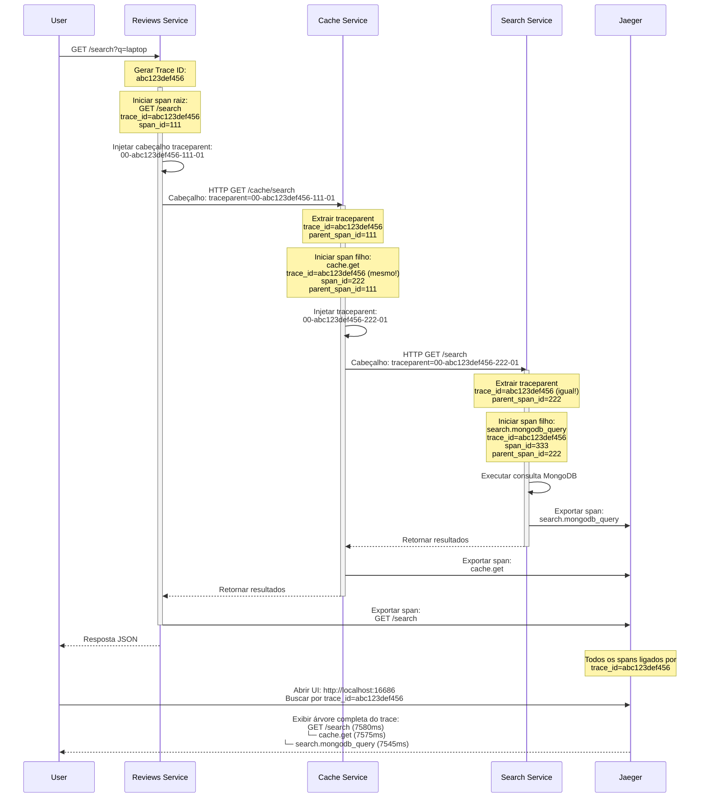
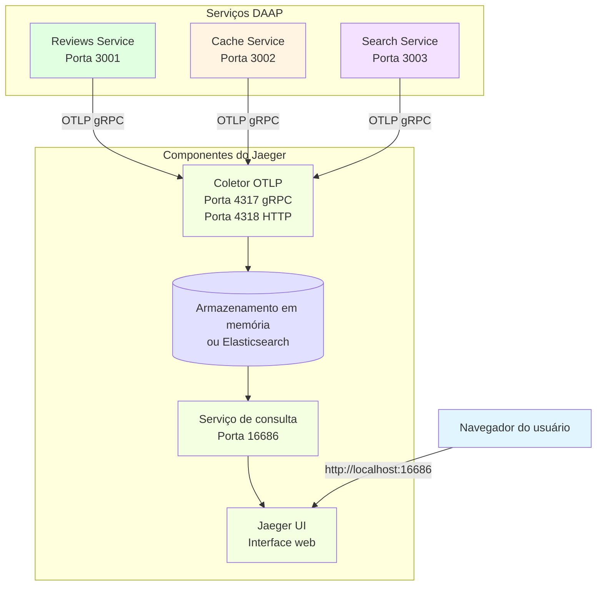
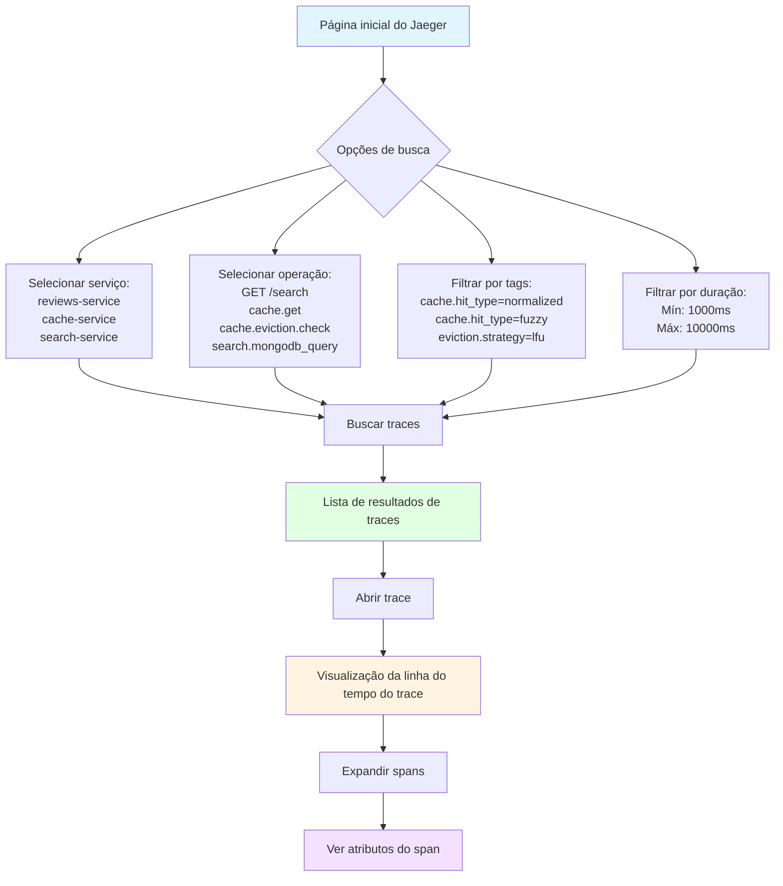
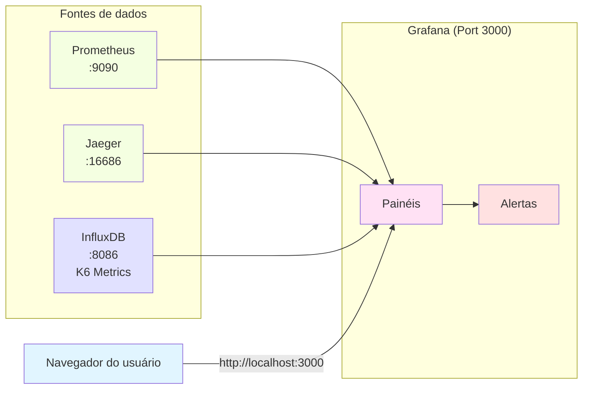

# Observability & Distributed Tracing

## Table of Contents
- [Overview](#overview)
- [OpenTelemetry Architecture](#opentelemetry-architecture)
- [Distributed Tracing](#distributed-tracing)
- [Semantic Conventions](#semantic-conventions)
- [Jaeger Integration](#jaeger-integration)
- [Prometheus Metrics](#prometheus-metrics)
- [Grafana Dashboards](#grafana-dashboards)
- [Troubleshooting](#troubleshooting)

## Overview

The DAAP system implements **comprehensive observability** using the **OpenTelemetry** standard for distributed tracing and metrics. All services are fully instrumented with automatic and custom spans, enabling end-to-end request tracking across microservices.

### Key Features

- **Distributed Tracing**: W3C Trace Context propagation across all services
- **Auto-Instrumentation**: HTTP (Express/Axios), MongoDB, NestJS Core
- **Custom Spans**: Business logic instrumentation (cache operations, eviction, searches)
- **44 Semantic Attributes**: Custom conventions for cache, eviction, search, keywords
- **Jaeger UI**: Visual trace exploration and analysis
- **Prometheus Metrics**: Cache hit rates, eviction metrics, response times
- **Grafana Dashboards**: Real-time monitoring and alerting

## OpenTelemetry Architecture

```mermaid
graph TB
    subgraph "Microservices"
        subgraph "Reviews Service"
            R_App[Código da aplicação]
            R_SDK[OpenTelemetry SDK]
            R_Auto[Auto-instrumentação<br/>HTTP, NestJS]
        end

        subgraph "Cache Service"
            C_App[Código da aplicação]
            C_SDK[OpenTelemetry SDK]
            C_Auto[Auto-instrumentação<br/>HTTP, NestJS]
            C_Custom[Spans customizados<br/>cache.get, cache.eviction]
        end

        subgraph "Search Service"
            S_App[Código da aplicação]
            S_SDK[OpenTelemetry SDK]
            S_Auto[Auto-instrumentação<br/>HTTP, MongoDB, NestJS]
            S_Custom[Spans customizados<br/>search.mongodb_query]
        end
    end

    subgraph "Telemetry Package (@daap/telemetry)"
        SDK[NodeSDK<br/>Inicialização]
        Tracer[TracingService<br/>Singleton]
        Context[Propagação de contexto<br/>HTTP headers]
        Constants[Convenções semânticas<br/>44 atributos]
        Metrics[Métricas Prometheus<br/>Cache, eviction, search]
    end

    subgraph "Backend de observabilidade"
        Jaeger[Jaeger<br/>Receptor OTLP<br/>Porta 4317 gRPC]
        Prometheus[Prometheus<br/>Coletor de métricas<br/>Porta 9090]
        Grafana[Grafana<br/>Visualização<br/>Porta 3000]
    end

    R_App --> R_SDK
    R_SDK --> R_Auto
    C_App --> C_SDK
    C_SDK --> C_Auto
    C_App --> C_Custom
    S_App --> S_SDK
    S_SDK --> S_Auto
    S_App --> S_Custom

    R_SDK -.->|Usa| SDK
    R_SDK -.->|Usa| Tracer
    R_SDK -.->|Usa| Context
    R_SDK -.->|Usa| Metrics

    C_SDK -.->|Usa| SDK
    C_SDK -.->|Usa| Tracer
    C_SDK -.->|Usa| Context
    C_SDK -.->|Usa| Constants
    C_SDK -.->|Usa| Metrics

    S_SDK -.->|Usa| SDK
    S_SDK -.->|Usa| Tracer
    S_SDK -.->|Usa| Context
    S_SDK -.->|Usa| Constants
    S_SDK -.->|Usa| Metrics

    R_SDK -->|OTLP gRPC| Jaeger
    C_SDK -->|OTLP gRPC| Jaeger
    S_SDK -->|OTLP gRPC| Jaeger

    R_App -->|Expor :9464| Prometheus
    C_App -->|Expor :9464| Prometheus
    S_App -->|Expor :9464| Prometheus

    Jaeger --> Grafana
    Prometheus --> Grafana

    style R_App fill:#e1ffe1
    style C_App fill:#fff4e1
    style S_App fill:#f4e1ff
    style SDK fill:#e1f5ff
    style Tracer fill:#e1f5ff
    style Context fill:#e1f5ff
    style Constants fill:#e1f5ff
    style Metrics fill:#e1f5ff
    style Jaeger fill:#f4ffe1
    style Prometheus fill:#f4ffe1
    style Grafana fill:#f4ffe1
```



### Telemetry Package Structure

**Location**: [packages/telemetry/](../packages/telemetry/)

```
packages/telemetry/
├── src/
│   ├── sdk.ts                      # NodeSDK initialization with auto-instrumentations
│   ├── tracer.ts                   # TracingService singleton
│   ├── context-propagation.ts      # HTTP header injection/extraction
│   ├── constants.ts                # 44 semantic conventions
│   ├── metrics.ts                  # Prometheus metrics initialization
│   ├── cache-metrics.ts            # Cache-specific Prometheus metrics
│   └── index.ts                    # Public exports
├── package.json
└── tsconfig.json
```

**Key Exports**:
```typescript
export { initializeTelemetry } from './sdk';
export { getTracingService } from './tracer';
export { injectTraceContext, extractTraceContext } from './context-propagation';
export { SemanticAttributes, CacheAttributes, EvictionAttributes } from './constants';
export { initializeMetrics, cacheMetrics } from './cache-metrics';
```

## Distributed Tracing

### Trace Context Propagation



### W3C Trace Context Format

**Header**: `traceparent`

**Format**: `00-{trace-id}-{parent-id}-{trace-flags}`

**Example**:
```
traceparent: 00-0af7651916cd43dd8448eb211c80319c-b7ad6b7169203331-01
             │   │                                │                │
             │   │                                │                └─ Trace flags (01 = sampled)
             │   │                                └── Parent span ID (16 hex digits)
             │   └────────────────────────────────── Trace ID (32 hex digits)
             └─────────────────────────────────────── Version (00)
```

**Implementation** ([packages/telemetry/src/context-propagation.ts](../packages/telemetry/src/context-propagation.ts)):

```typescript
import { propagation, context } from '@opentelemetry/api';

export function injectTraceContext(headers: Record<string, string>): Record<string, string> {
  const carrier: Record<string, string> = { ...headers };
  propagation.inject(context.active(), carrier);
  return carrier;
}

export function extractTraceContext(headers: Record<string, string>): void {
  const ctx = propagation.extract(context.active(), headers);
  context.setGlobalContextManager(ctx);
}
```

### Auto-Instrumentation

**Location**: [packages/telemetry/src/sdk.ts](../packages/telemetry/src/sdk.ts)

```typescript
import { NodeSDK } from '@opentelemetry/sdk-node';
import { HttpInstrumentation } from '@opentelemetry/instrumentation-http';
import { ExpressInstrumentation } from '@opentelemetry/instrumentation-express';
import { MongoDBInstrumentation } from '@opentelemetry/instrumentation-mongodb';
import { NestInstrumentation } from '@opentelemetry/instrumentation-nestjs-core';

const sdk = new NodeSDK({
  serviceName: process.env.SERVICE_NAME || 'daap-service',
  traceExporter: new OTLPTraceExporter({
    url: process.env.OTEL_EXPORTER_OTLP_ENDPOINT || 'http://jaeger:4317',
  }),
  instrumentations: [
    new HttpInstrumentation(),          // Auto-trace HTTP requests/responses
    new ExpressInstrumentation(),       // Auto-trace Express routes
    new MongoDBInstrumentation(),       // Auto-trace MongoDB queries
    new NestInstrumentation(),          // Auto-trace NestJS lifecycle
  ],
});

sdk.start();
```

**Auto-Instrumented Operations**:
- **HTTP Client** (Axios): Outgoing requests to other services
- **HTTP Server** (Express): Incoming API requests
- **MongoDB**: `find()`, `countDocuments()`, `aggregate()`, etc.
- **NestJS**: Controller methods, middleware, guards

### Custom Spans

#### Cache Service Example

**Location**: [apps/cache-service/src/modules/cache/service.ts](../apps/cache-service/src/modules/cache/service.ts)

```typescript
import { getTracingService } from '@daap/telemetry';

export class CacheService {
  private readonly tracing = getTracingService('cache-service');

  async get(query: string, page: number, size: number): Promise<SearchResult | null> {
    return this.tracing.startActiveSpan('cache.get', async (span) => {
      span.setAttributes({
        'cache.operation': 'get',
        'cache.query': query,
        'cache.page': page,
        'cache.size': size,
      });

      // 1. Normalized lookup
      const normalized = await this.normalizedLookup(query, page, size);
      if (normalized) {
        span.setAttributes({
          'cache.hit': true,
          'cache.hit_type': 'normalized',
        });
        return normalized;
      }

      // 2. Fuzzy lookup
      if (this.fuzzyEnabled) {
        const fuzzy = await this.fuzzyLookup(query, page, size);
        if (fuzzy) {
          span.setAttributes({
            'cache.hit': true,
            'cache.hit_type': 'fuzzy',
          });
          return fuzzy;
        }
      }

      // 3. Cache miss
      span.setAttributes({
        'cache.hit': false,
        'cache.hit_type': 'miss',
      });

      return null;
    });
  }

  private async normalizedLookup(query: string, page: number, size: number) {
    return this.tracing.startActiveSpan('cache.lookup.normalized', async (span) => {
      const key = this.generateCacheKey(query, page, size);
      span.setAttribute('cache.key', key);

      const cached = await this.cacheAdapter.get(key);
      span.setAttribute('cache.hit', !!cached);

      return cached ? JSON.parse(cached) : null;
    });
  }
}
```

#### Search Service Example

**Location**: [apps/search-service/src/modules/search/service.ts](../apps/search-service/src/modules/search/service.ts)

```typescript
import { getTracingService } from '@daap/telemetry';

export class SearchService {
  private readonly tracing = getTracingService('search-service');

  async search(query: string, page: number, size: number): Promise<SearchResult> {
    return this.tracing.startActiveSpan('search.mongodb_query', async (span) => {
      span.setAttributes({
        'search.query': query,
        'search.page': page,
        'search.size': size,
        'mongodb.collection': 'reviews',
        'mongodb.operation': 'find',
      });

      const skip = (page - 1) * size;
      const searchCriteria = { $text: { $search: query } };

      // Auto-instrumented by MongoDBInstrumentation
      const items = await this.reviewModel
        .find(searchCriteria, { score: { $meta: 'textScore' } })
        .sort({ score: { $meta: 'textScore' } })
        .skip(skip)
        .limit(size)
        .exec();

      const total = await this.reviewModel.countDocuments(searchCriteria);

      span.setAttributes({
        'search.results.total': total,
        'search.results.returned': items.length,
      });

      return { items, total, page, size };
    });
  }
}
```

## Semantic Conventions

The DAAP system defines **44 custom semantic attributes** for detailed observability.

**Location**: [packages/telemetry/src/constants.ts](../packages/telemetry/src/constants.ts)

### Cache Attributes

```typescript
export const CacheAttributes = {
  // Operation metadata
  CACHE_OPERATION: 'cache.operation',        // get | set | invalidate
  CACHE_KEY: 'cache.key',                    // Redis key
  CACHE_HIT: 'cache.hit',                    // Boolean
  CACHE_HIT_TYPE: 'cache.hit_type',          // normalized | fuzzy | miss

  // Query parameters
  CACHE_QUERY: 'cache.query',                // User query
  CACHE_PAGE: 'cache.page',                  // Pagination page
  CACHE_SIZE: 'cache.size',                  // Page size

  // Fuzzy matching
  CACHE_FUZZY_SIMILARITY: 'cache.fuzzy.similarity',     // Jaccard score (0.0-1.0)
  CACHE_FUZZY_CANDIDATES: 'cache.fuzzy.candidates',     // Number evaluated
  CACHE_FUZZY_MATCH_KEY: 'cache.fuzzy.match_key',       // Matched cache key

  // Entry metadata
  CACHE_ENTRY_SIZE: 'cache.entry.size',      // Bytes
  CACHE_ENTRY_FREQUENCY: 'cache.entry.frequency',  // Access count
  CACHE_ENTRY_LAST_ACCESS: 'cache.entry.last_access',  // Unix timestamp
};
```

### Eviction Attributes

```typescript
export const EvictionAttributes = {
  // Strategy metadata
  EVICTION_STRATEGY: 'eviction.strategy',    // lfu | lru | hybrid
  EVICTION_TRIGGERED: 'eviction.triggered',  // Boolean

  // Capacity
  EVICTION_ENTRIES_BEFORE: 'eviction.entries.before',  // Count before eviction
  EVICTION_ENTRIES_AFTER: 'eviction.entries.after',    // Count after eviction
  EVICTION_ENTRIES_EVICTED: 'eviction.entries.evicted',  // Number removed

  // Scores
  EVICTION_SCORE_AVG: 'eviction.score.avg',  // Average eviction score
  EVICTION_SCORE_MIN: 'eviction.score.min',  // Min score evicted
  EVICTION_SCORE_MAX: 'eviction.score.max',  // Max score evicted

  // Performance
  EVICTION_DURATION_MS: 'eviction.duration_ms',  // Eviction latency
  EVICTION_UTILIZATION_BEFORE: 'eviction.utilization.before',  // Percentage
  EVICTION_UTILIZATION_AFTER: 'eviction.utilization.after',    // Percentage
};
```

### Search Attributes

```typescript
export const SearchAttributes = {
  // Query metadata
  SEARCH_QUERY: 'search.query',              // User query
  SEARCH_PAGE: 'search.page',                // Pagination page
  SEARCH_SIZE: 'search.size',                // Page size

  // Results
  SEARCH_RESULTS_TOTAL: 'search.results.total',        // Total matches
  SEARCH_RESULTS_RETURNED: 'search.results.returned',  // Returned count

  // MongoDB
  MONGODB_COLLECTION: 'mongodb.collection',  // Collection name
  MONGODB_OPERATION: 'mongodb.operation',    // find | countDocuments | aggregate
};
```

### Keyword Attributes

```typescript
export const KeywordAttributes = {
  KEYWORD_COUNT: 'keyword.count',                    // Number extracted
  KEYWORD_EXTRACTION_METHOD: 'keyword.extraction.method',  // porter | stopwords
};
```

## Jaeger Integration

### Architecture



### Accessing Jaeger UI

**URL**: [http://localhost:16686](http://localhost:16686)

**Interface**:


### Example Trace Queries

#### 1. Find Cache Misses

```
Service: cache-service
Tags: cache.hit_type=miss
```

**Use Case**: Identify queries not hitting cache (optimization opportunities)

#### 2. Find Slow Evictions

```
Service: cache-service
Operation: cache.eviction.check
Min Duration: 200ms
```

**Use Case**: Detect eviction performance issues

#### 3. Find Fuzzy Matches

```
Service: cache-service
Tags: cache.hit_type=fuzzy
```

**Use Case**: Analyze fuzzy matching effectiveness

#### 4. Find MongoDB Slow Queries

```
Service: search-service
Operation: search.mongodb_query
Min Duration: 5000ms
```

**Use Case**: Identify expensive MongoDB queries

### Trace Visualization

**Sample Trace** (Cache Miss):

```
Trace ID: 0af7651916cd43dd8448eb211c80319c
Duration: 7580ms
Spans: 5

├─ reviews-service: GET /search (7580ms)
│  └─ http.client (7575ms)
│     └─ cache-service: cache.get (7570ms)
│        ├─ cache.lookup.normalized (2ms) [cache.hit=false]
│        ├─ cache.lookup.fuzzy (8ms) [cache.hit=false]
│        └─ http.client (7550ms)
│           └─ search-service: search.mongodb_query (7545ms)
│              ├─ mongodb.find (3800ms)
│              └─ mongodb.countDocuments (3745ms)
```

**Attributes on `cache.get` span**:
```json
{
  "cache.operation": "get",
  "cache.query": "laptop",
  "cache.page": 1,
  "cache.size": 10,
  "cache.hit": false,
  "cache.hit_type": "miss"
}
```

## Prometheus Metrics

### Cache Metrics

**Location**: [packages/telemetry/src/cache-metrics.ts](../packages/telemetry/src/cache-metrics.ts)

```typescript
import { Counter, Histogram, Gauge } from 'prom-client';

export const cacheMetrics = {
  // Hit rate tracking
  cacheHits: new Counter({
    name: 'cache_hits_total',
    help: 'Total cache hits',
    labelNames: ['hit_type'], // normalized, fuzzy
  }),

  cacheMisses: new Counter({
    name: 'cache_misses_total',
    help: 'Total cache misses',
  }),

  // Response time
  cacheResponseTime: new Histogram({
    name: 'cache_response_time_ms',
    help: 'Cache operation response time in milliseconds',
    labelNames: ['operation'], // get, set, invalidate
    buckets: [1, 5, 10, 25, 50, 100, 250, 500, 1000],
  }),

  // Eviction metrics
  evictionDuration: new Histogram({
    name: 'eviction_duration_ms',
    help: 'Eviction operation duration in milliseconds',
    labelNames: ['strategy'], // lfu, lru, hybrid
    buckets: [10, 25, 50, 100, 150, 200, 300, 500, 1000],
  }),

  evictionEntriesRemoved: new Histogram({
    name: 'eviction_entries_removed',
    help: 'Number of entries removed per eviction',
    labelNames: ['strategy'],
    buckets: [10, 25, 50, 75, 100, 150, 200],
  }),

  // Capacity
  cacheSize: new Gauge({
    name: 'cache_size_entries',
    help: 'Current number of entries in cache',
  }),

  cacheUtilization: new Gauge({
    name: 'cache_utilization_percent',
    help: 'Cache utilization as percentage of max entries',
  }),
};
```

### Recording Metrics

**Cache Hit Example**:
```typescript
cacheMetrics.cacheHits.inc({ hit_type: 'normalized' });
cacheMetrics.cacheResponseTime.observe({ operation: 'get' }, 8);
```

**Eviction Example**:
```typescript
const start = Date.now();
// ... eviction logic ...
const duration = Date.now() - start;

cacheMetrics.evictionDuration.observe({ strategy: 'lfu' }, duration);
cacheMetrics.evictionEntriesRemoved.observe({ strategy: 'lfu' }, 50);
cacheMetrics.cacheUtilization.set(95);
```

### Prometheus Queries

**Cache Hit Rate**:
```promql
rate(cache_hits_total[5m]) / (rate(cache_hits_total[5m]) + rate(cache_misses_total[5m])) * 100
```

**Average Eviction Duration**:
```promql
rate(eviction_duration_ms_sum[5m]) / rate(eviction_duration_ms_count[5m])
```

**Cache Utilization Over Time**:
```promql
cache_utilization_percent
```

## Grafana Dashboards

### Architecture



### Recommended Dashboards

#### 1. Cache Performance Dashboard

**Panels**:
- Cache hit rate (pie chart): Normalized vs Fuzzy vs Miss
- Response time (time series): Cache vs MongoDB
- Cache size (gauge): Current entries / Max entries
- Hit rate over time (line graph): Last 1 hour
- Top queries (table): By frequency

**Queries**:
```promql
# Hit rate by type
sum by(hit_type) (rate(cache_hits_total[5m]))

# Average response time
histogram_quantile(0.95, rate(cache_response_time_ms_bucket[5m]))

# Current cache size
cache_size_entries
```

#### 2. Eviction Monitoring Dashboard

**Panels**:
- Eviction frequency (counter): Evictions per minute
- Eviction duration (histogram): P50, P95, P99
- Entries removed per eviction (histogram)
- Utilization before/after (time series)
- Eviction strategy (label): Current strategy

**Queries**:
```promql
# Eviction rate
rate(eviction_duration_ms_count[5m])

# P95 eviction duration
histogram_quantile(0.95, rate(eviction_duration_ms_bucket[5m]))

# Average entries removed
rate(eviction_entries_removed_sum[5m]) / rate(eviction_entries_removed_count[5m])
```

#### 3. Service Health Dashboard

**Panels**:
- Request rate (time series): Requests per second
- Error rate (time series): 5xx errors per second
- Response time P95/P99 (time series)
- Active instances (gauge): Reviews Service replicas
- CPU/Memory usage (Docker stats)

#### 4. Distributed Tracing Dashboard

**Integration**: Grafana → Jaeger data source

**Features**:
- Trace search from Grafana
- Embed trace timelines in dashboards
- Correlate metrics with traces (exemplars)

### Accessing Grafana

**URL**: [http://localhost:3000](http://localhost:3000)

**Default Credentials**:
- Username: `admin`
- Password: `admin`

**Configuration**:
```yaml
# grafana/provisioning/datasources/datasources.yml
datasources:
  - name: Prometheus
    type: prometheus
    url: http://prometheus:9090
    access: proxy

  - name: Jaeger
    type: jaeger
    url: http://jaeger:16686
    access: proxy

  - name: InfluxDB
    type: influxdb
    url: http://influxdb:8086
    database: k6
```

## Troubleshooting

### Traces Not Appearing in Jaeger

**Symptom**: Services running but no traces in Jaeger UI

**Diagnosis**:
```bash
# 1. Check Jaeger is running
docker ps | grep jaeger

# 2. Check service logs for OpenTelemetry initialization
docker logs daap-cache-service | grep OpenTelemetry
# Expected: "[OpenTelemetry] Initialized for service: cache-service"

# 3. Check OTLP endpoint configuration
docker exec daap-cache-service env | grep OTEL_EXPORTER_OTLP_ENDPOINT
# Expected: http://jaeger:4317

# 4. Test connectivity to Jaeger
docker exec daap-cache-service curl -v http://jaeger:4317
```

**Fix**: Ensure `OTEL_EXPORTER_OTLP_ENDPOINT` is set correctly in `.env`:
```bash
OTEL_EXPORTER_OTLP_ENDPOINT=http://jaeger:4317
```

### Traces Incomplete (Missing Spans)

**Symptom**: Parent span exists but child spans missing

**Diagnosis**:
```bash
# Check if traceparent header is injected
docker logs daap-reviews-service | grep traceparent

# Check if child service extracts context
docker logs daap-cache-service | grep "Extracted trace context"
```

**Fix**: Verify HTTP interceptor injects trace context:

**Location**: [apps/reviews-service/src/lib/modules/http/service.ts](../apps/reviews-service/src/lib/modules/http/service.ts)

```typescript
import { injectTraceContext } from '@daap/telemetry';

instance.interceptors.request.use((config) => {
  const tracedHeaders = injectTraceContext(config.headers || {});
  config.headers = { ...config.headers, ...tracedHeaders };
  return config;
});
```

### High Cardinality Warning

**Symptom**: Prometheus complaining about too many unique label combinations

**Cause**: Using high-cardinality attributes as labels (e.g., `cache.query`)

**Fix**: Use low-cardinality labels only:
```typescript
// ❌ WRONG - High cardinality
cacheMetrics.cacheHits.inc({ query: query });  // Unlimited unique queries

// ✅ CORRECT - Low cardinality
cacheMetrics.cacheHits.inc({ hit_type: 'normalized' });  // Only 2 values
```

### Span Timing Issues

**Symptom**: Spans show 0ms or incorrect duration

**Cause**: Span ended before async operation completes

**Fix**: Always use `startActiveSpan()` with async/await:
```typescript
// ✅ CORRECT
return this.tracing.startActiveSpan('operation', async (span) => {
  const result = await asyncOperation();
  return result;  // Span auto-ends after return
});

// ❌ WRONG
this.tracing.startActiveSpan('operation', async (span) => {
  asyncOperation();  // No await!
  return;  // Span ends immediately
});
```

## Next Steps

- [Deployment Guide](./06-deployment.md) - Production observability configuration
- [Testing Strategy](./07-testing.md) - Using Jaeger for load test analysis
