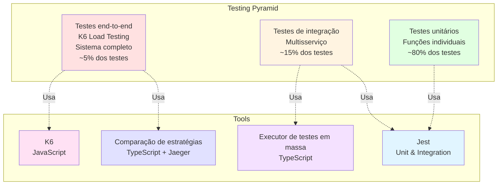
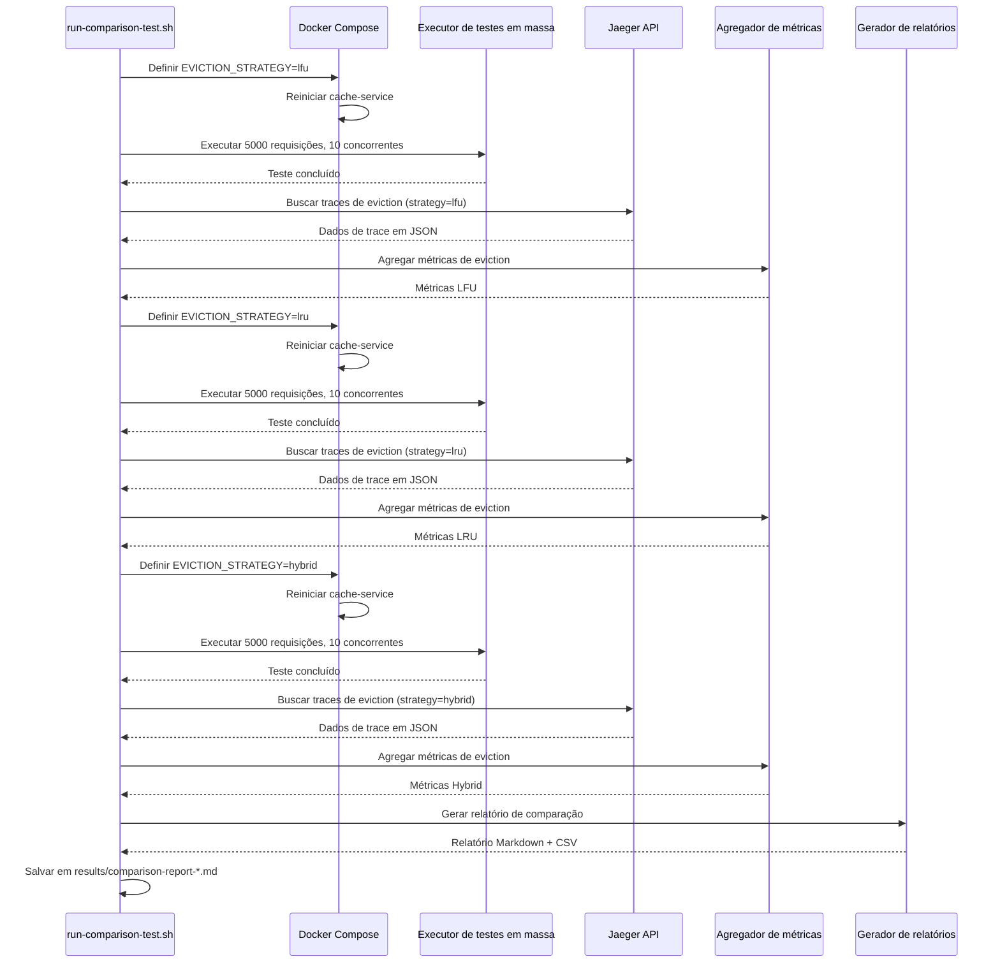
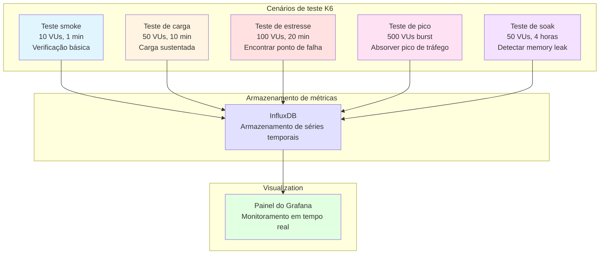
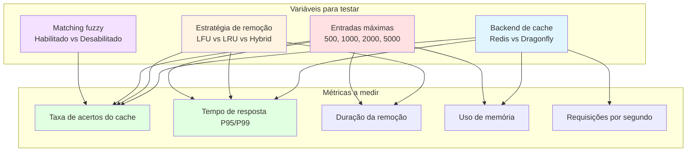

# Testing Strategy

## Table of Contents
- [Overview](#overview)
- [Testing Pyramid](#testing-pyramid)
- [Unit Testing](#unit-testing)
- [Integration Testing](#integration-testing)
- [Load Testing](#load-testing)
- [Strategy Comparison Testing](#strategy-comparison-testing)
- [K6 Advanced Testing](#k6-advanced-testing)
- [Performance Benchmarking](#performance-benchmarking)

## Overview

The DAAP project implements a **comprehensive testing strategy** covering unit tests, integration tests, load tests, and performance benchmarks. The focus is on **validating cache performance** and **comparing eviction strategies** under realistic load.

## Testing Pyramid



### Test Coverage Goals

| Test Type | Coverage | Purpose |
|-----------|----------|---------|
| **Unit Tests** | 80%+ | Validate individual functions and classes |
| **Integration Tests** | Key flows | Validate service-to-service communication |
| **Load Tests** | All eviction strategies | Validate performance under realistic load |
| **Benchmark Tests** | All configurations | Compare cache backends and strategies |

## Unit Testing

### Framework: Jest

**Location**: All `*.spec.ts` files

**Configuration**: [packages/jest-presets/](../packages/jest-presets/)

```typescript
// jest.config.js (shared)
module.exports = {
  preset: '@daap/jest-presets/node',
  testEnvironment: 'node',
  testMatch: ['**/*.spec.ts'],
  collectCoverageFrom: [
    'src/**/*.ts',
    '!src/**/*.spec.ts',
    '!src/main.ts',
  ],
  coverageThreshold: {
    global: {
      branches: 80,
      functions: 80,
      lines: 80,
      statements: 80,
    },
  },
};
```

### Example: LFU Strategy Unit Test

**Location**: [apps/cache-service/src/lib/cache/strategies/lfu.strategy.spec.ts](../apps/cache-service/src/lib/cache/strategies/lfu.strategy.spec.ts)

```typescript
import { LFUStrategy } from './lfu.strategy';
import { CacheAdapter } from '../adapter';

describe('LFUStrategy', () => {
  let strategy: LFUStrategy;
  let mockAdapter: jest.Mocked<CacheAdapter>;

  beforeEach(() => {
    mockAdapter = {
      smembers: jest.fn(),
      scard: jest.fn(),
      hgetall: jest.fn(),
      del: jest.fn(),
      srem: jest.fn(),
      zincrby: jest.fn(),
    } as any;

    strategy = new LFUStrategy(mockAdapter, mockKeywordService, mockConfig);
  });

  describe('calculateEvictionScore', () => {
    it('should prioritize low-frequency entries for eviction', () => {
      const lowFreq = { frequency: 1, lastAccess: Date.now(), size: 1000, keywords: ['test'] };
      const highFreq = { frequency: 100, lastAccess: Date.now(), size: 1000, keywords: ['test'] };

      const lowScore = strategy['calculateEvictionScore'](lowFreq);
      const highScore = strategy['calculateEvictionScore'](highFreq);

      expect(lowScore).toBeGreaterThan(highScore);  // Higher score = worse = evict first
    });

    it('should use age as tiebreaker for same frequency', () => {
      const recent = { frequency: 10, lastAccess: Date.now(), size: 1000, keywords: ['test'] };
      const old = { frequency: 10, lastAccess: Date.now() - 24 * 60 * 60 * 1000, size: 1000, keywords: ['test'] };

      const recentScore = strategy['calculateEvictionScore'](recent);
      const oldScore = strategy['calculateEvictionScore'](old);

      expect(oldScore).toBeGreaterThan(recentScore);  // Older entry has higher score
    });
  });

  describe('checkAndEvict', () => {
    it('should not evict when below max entries', async () => {
      mockAdapter.scard.mockResolvedValue(500);  // Below 1000

      await strategy.checkAndEvict();

      expect(mockAdapter.smembers).not.toHaveBeenCalled();  // No eviction triggered
    });

    it('should evict BATCH_SIZE entries when above max', async () => {
      mockAdapter.scard.mockResolvedValue(1050);  // Above 1000
      mockAdapter.smembers.mockResolvedValue([...Array(1050).keys()].map(i => `key${i}`));

      // Mock metadata for each key
      mockAdapter.hgetall.mockImplementation(async (key) => ({
        frequency: '1',
        lastAccess: String(Date.now()),
        size: '1000',
        keywords: '["test"]',
      }));

      await strategy.checkAndEvict();

      expect(mockAdapter.del).toHaveBeenCalledTimes(50);  // BATCH_SIZE = 50
    });
  });
});
```

### Running Unit Tests

```bash
# Run all unit tests
pnpm test

# Run tests for specific service
cd apps/cache-service
pnpm test

# Run with coverage
pnpm test:coverage

# Run in watch mode
pnpm test:watch

# Run specific test file
pnpm test lfu.strategy.spec.ts
```

## Integration Testing

### Service-to-Service Tests

**Location**: [apps/reviews-service/src/modules/search/service.integration.spec.ts](../apps/reviews-service/src/modules/search/service.integration.spec.ts)

```typescript
import { Test } from '@nestjs/testing';
import { SearchService } from './service';
import { HttpService } from '../../lib/modules/http/service';

describe('SearchService Integration', () => {
  let service: SearchService;
  let httpService: HttpService;

  beforeAll(async () => {
    const module = await Test.createTestingModule({
      providers: [SearchService, HttpService, SecretsService],
    }).compile();

    service = module.get<SearchService>(SearchService);
    httpService = module.get<HttpService>(HttpService);
  });

  describe('search with cache fallback', () => {
    it('should return cached data when cache service is available', async () => {
      const result = await service.search('laptop', 1, 10);

      expect(result).toHaveProperty('items');
      expect(result).toHaveProperty('total');
      expect(result.source).toBeOneOf(['cache', 'search']);
    });

    it('should fallback to search service when cache is unavailable', async () => {
      // Simulate cache service down
      jest.spyOn(httpService, 'get').mockImplementationOnce(() => {
        throw new Error('Cache service unavailable');
      });

      const result = await service.search('laptop', 1, 10);

      expect(result.source).toBe('search-direct');
    });
  });
});
```

### Database Integration Tests

**Location**: [apps/search-service/src/modules/search/service.integration.spec.ts](../apps/search-service/src/modules/search/service.integration.spec.ts)

```typescript
import { Test } from '@nestjs/testing';
import { MongooseModule } from '@nestjs/mongoose';
import { SearchService } from './service';
import { Review, ReviewSchema } from '@daap/schema';

describe('SearchService Database Integration', () => {
  let service: SearchService;

  beforeAll(async () => {
    const module = await Test.createTestingModule({
      imports: [
        MongooseModule.forRoot('mongodb://localhost:27017/daap_test'),
        MongooseModule.forFeature([{ name: Review.name, schema: ReviewSchema }]),
      ],
      providers: [SearchService],
    }).compile();

    service = module.get<SearchService>(SearchService);
  });

  it('should perform MongoDB full-text search', async () => {
    const result = await service.search('laptop', 1, 10);

    expect(result.items.length).toBeLessThanOrEqual(10);
    expect(result.total).toBeGreaterThan(0);
    expect(result.items[0]).toHaveProperty('description');
  });

  it('should return empty results for nonsensical query', async () => {
    const result = await service.search('xyzabc123456', 1, 10);

    expect(result.items).toEqual([]);
    expect(result.total).toBe(0);
  });
});
```

## Load Testing

### Bulk Test Runner

**Location**: [packages/tools/load-testing/](../packages/tools/load-testing/)

```mermaid
flowchart TD
    Start([Iniciar teste de carga]) --> LoadQueries[Carregar dataset de consultas<br/>data/queries.json]

    LoadQueries --> Configure[Configurar teste:<br/>- Total de requisições<br/>- Concorrência<br/>- URL alvo]

    Configure --> CreatePool[Criar pool de workers<br/>N workers concorrentes]

    CreatePool --> Loop{Mais<br/>requisições?}

    Loop -->|Sim| SendRequest[Enviar requisição HTTP<br/>GET /search?q={query}]

    SendRequest --> MeasureTime[Medir tempo de resposta]

    MeasureTime --> RecordMetrics[Registrar métricas:<br/>- Tempo de resposta<br/>- Status code<br/>- Fonte (cache/search)<br/>- Query]

    RecordMetrics --> Loop

    Loop -->|Não| Aggregate[Consolidar resultados:<br/>- Tempo médio/mín/máx<br/>- P50/P95/P99<br/>- Taxa de acerto do cache<br/>- Taxa de erro]

    Aggregate --> SaveResults[Salvar resultados:<br/>results/summary-*.json]

    SaveResults --> GenerateReport[Gerar relatório:<br/>Markdown + CSV]

    GenerateReport --> End([Fim])

    style Start fill:#e1f5ff
    style SendRequest fill:#fff4e1
    style Aggregate fill:#e1ffe1
    style End fill:#f4e1ff
```

### Running Load Tests

```bash
# Navigate to load testing directory
cd packages/tools/load-testing

# Install dependencies
pnpm install

# Run bulk test: 10k requests, 5 concurrent
pnpm test:bulk 10000 5

# Results saved to:
# - results/summary-lfu-2025-11-01T12-00-00-000Z.json
# - results/summary-lfu-2025-11-01T12-00-00-000Z.md
```

### Sample Load Test Output

```markdown
# Load Test Results

**Strategy**: LFU
**Date**: 2025-11-01T12:00:00.000Z
**Total Requests**: 10000
**Concurrency**: 5

## Performance Metrics

| Metric | Value |
|--------|-------|
| Average Response Time | 730ms |
| Median (P50) | 8ms |
| P95 Response Time | 12ms |
| P99 Response Time | 7580ms |
| Min Response Time | 5ms |
| Max Response Time | 9200ms |

## Cache Metrics

| Metric | Count | Percentage |
|--------|-------|------------|
| **Cache Hits (Normalized)** | 6000 | 60% |
| **Cache Hits (Fuzzy)** | 3100 | 31% |
| **Cache Misses** | 900 | 9% |
| **Total Cache Hits** | 9100 | **91%** |

## Source Distribution

- Cache: 9100 (91%)
- Search: 900 (9%)
- Search Direct (Fallback): 0 (0%)

## Error Rate

- Successful (2xx): 10000 (100%)
- Client Errors (4xx): 0 (0%)
- Server Errors (5xx): 0 (0%)
```

### Analyzing Load Test Results

```bash
# Analyze keyword popularity from test results
pnpm analyze:keywords

# Output: results/keyword-analysis-*.md
```

**Sample Keyword Analysis**:

```markdown
# Keyword Analysis

## Top 20 Most Popular Keywords

| Rank | Keyword | Frequency | Avg Response Time |
|------|---------|-----------|-------------------|
| 1 | laptop | 523 | 8ms |
| 2 | charger | 412 | 9ms |
| 3 | cable | 387 | 10ms |
| 4 | usb | 345 | 8ms |
| 5 | screen | 298 | 11ms |
...
```

## Strategy Comparison Testing

### Automated Comparison Framework

**Location**: [packages/tools/strategy-comparison/](../packages/tools/strategy-comparison/)



### Running Strategy Comparison

```bash
# Navigate to strategy comparison directory
cd packages/tools/strategy-comparison

# Run automated comparison (tests all 3 strategies)
./run-comparison-test.sh 5000 10

# Arguments:
#   $1: Requests per strategy (default: 5000)
#   $2: Concurrency (default: 10)

# Estimated time: ~20-30 minutes

# Results saved to:
# - packages/tools/results/comparison-report-*.md
# - packages/tools/results/comparison-report-*.csv
# - packages/tools/results/traces/*.json
```

### Sample Comparison Report

```markdown
# Eviction Strategy Comparison Report

**Test Date**: 2025-11-01
**Requests per Strategy**: 5000
**Concurrency**: 10

## Summary

| Strategy | Total Evictions | Avg Duration (ms) | Avg Entries Evicted | Cache Hit Rate |
|----------|-----------------|-------------------|---------------------|----------------|
| **LFU** | 42 | 123 | 50.2 | **91%** |
| **LRU** | 58 | 98 | 50.1 | 87% |
| **Hybrid (0.6/0.4)** | 48 | 112 | 50.0 | 90% |

## LFU Strategy

- **Total Evictions**: 42
- **Duration**: Avg 123ms, P95 187ms, P99 245ms
- **Entries Evicted**: Avg 50.2, Total 2108
- **Eviction Score**: Avg 2.34, Min 0.11, Max 5.30
- **Utilization**: 100% → 95% (avg)
- **Efficiency**: 0.41 entries/ms

## LRU Strategy

- **Total Evictions**: 58
- **Duration**: Avg 98ms, P95 142ms, P99 189ms
- **Entries Evicted**: Avg 50.1, Total 2906
- **Eviction Score**: Avg 172800000 (48 hours in ms)
- **Utilization**: 100% → 94% (avg)
- **Efficiency**: 0.51 entries/ms

## Hybrid Strategy (0.6/0.4)

- **Total Evictions**: 48
- **Duration**: Avg 112ms, P95 165ms, P99 218ms
- **Entries Evicted**: Avg 50.0, Total 2400
- **Eviction Score**: Avg 1.87
- **Utilization**: 100% → 95% (avg)
- **Efficiency**: 0.45 entries/ms

## Recommendation

**LFU Strategy** is recommended for this workload due to:
- Highest cache hit rate (91%)
- Fewest total evictions (42 vs 58/48)
- Best suited for repeated popular queries
```

## K6 Advanced Testing

### K6 Test Scenarios

**Location**: [packages/tools/k6/scenarios/](../packages/tools/k6/scenarios/)



### Example K6 Script

**Location**: [packages/tools/k6/scenarios/load-test.js](../packages/tools/k6/scenarios/load-test.js)

```javascript
import http from 'k6/http';
import { check, sleep } from 'k6';
import { Rate, Trend } from 'k6/metrics';

// Custom metrics
const cacheHitRate = new Rate('cache_hit_rate');
const cacheResponseTime = new Trend('cache_response_time');

export const options = {
  stages: [
    { duration: '2m', target: 50 },   // Ramp up to 50 VUs
    { duration: '10m', target: 50 },  // Stay at 50 VUs
    { duration: '2m', target: 0 },    // Ramp down
  ],
  thresholds: {
    http_req_duration: ['p95<500'],   // 95% of requests under 500ms
    cache_hit_rate: ['rate>0.80'],    // 80%+ cache hit rate
  },
};

export default function () {
  const queries = ['laptop', 'charger', 'cable', 'usb', 'screen'];
  const query = queries[Math.floor(Math.random() * queries.length)];

  const res = http.get(`http://reviews.localhost/search?q=${query}&page=1&size=10`);

  check(res, {
    'status is 200': (r) => r.status === 200,
    'has items': (r) => JSON.parse(r.body).items.length > 0,
  });

  // Track cache hits
  const body = JSON.parse(res.body);
  cacheHitRate.add(body.source === 'cache' ? 1 : 0);

  if (body.source === 'cache') {
    cacheResponseTime.add(res.timings.duration);
  }

  sleep(1);  // 1 second think time
}
```

### Running K6 Tests

```bash
# Navigate to K6 directory
cd packages/tools/k6

# Run specific scenario
pnpm k6:test:load    # Load test
pnpm k6:test:stress  # Stress test
pnpm k6:test:spike   # Spike test

# Run with specific strategy
EVICTION_STRATEGY=lfu pnpm k6:test:load

# Compare all strategies
pnpm k6:compare

# View results in Grafana
open http://localhost:3000
```

### K6 Output

```
     ✓ status is 200
     ✓ has items

     checks.........................: 100.00% ✓ 30000      ✗ 0
     data_received..................: 450 MB  75 kB/s
     data_sent......................: 3.0 MB  500 B/s
     http_req_blocked...............: avg=1.2ms    min=0s      med=0s      max=120ms   p(90)=0s      p(95)=0s
     http_req_duration..............: avg=8.5ms    min=5ms     med=8ms     max=7580ms  p(90)=10ms    p(95)=12ms
     http_reqs......................: 30000   500/s
     iteration_duration.............: avg=1.01s    min=1s      med=1s      max=1.1s    p(90)=1.01s   p(95)=1.02s

     cache_hit_rate.................: 91.00%  ✓ 27300      ✗ 2700
     cache_response_time............: avg=7.8ms    min=5ms     med=8ms     max=15ms    p(90)=9ms     p(95)=11ms
```

## Performance Benchmarking

### Benchmark Matrix



### Running Benchmarks

```bash
# Benchmark: Redis vs Dragonfly
./packages/tools/load-testing/benchmark-cache-backends.sh

# Benchmark: Different max entries
for ENTRIES in 500 1000 2000 5000; do
  EVICTION_MAX_ENTRIES=$ENTRIES pnpm test:bulk 5000 10
done

# Benchmark: Fuzzy matching enabled vs disabled
ENABLE_FUZZY_CACHE=true pnpm test:bulk 5000 10
ENABLE_FUZZY_CACHE=false pnpm test:bulk 5000 10
```

### Sample Benchmark Results

| Configuration | Cache Hit Rate | P95 Response Time | Eviction Duration | Memory Usage |
|---------------|----------------|-------------------|-------------------|--------------|
| **LFU, Redis, 1000 entries, Fuzzy ON** | 91% | 12ms | 123ms | 512MB |
| **LFU, Redis, 1000 entries, Fuzzy OFF** | 76% | 15ms | 118ms | 480MB |
| **LFU, Dragonfly, 1000 entries, Fuzzy ON** | 91% | 10ms | 115ms | 450MB |
| **LRU, Redis, 1000 entries, Fuzzy ON** | 87% | 14ms | 98ms | 512MB |
| **Hybrid (0.6/0.4), Redis, 1000 entries, Fuzzy ON** | 90% | 13ms | 112ms | 512MB |
| **LFU, Redis, 2000 entries, Fuzzy ON** | 96% | 10ms | 145ms | 850MB |

## Next Steps

- [Architecture Overview](./01-architecture-overview.md) - System design
- [Cache Strategies](./04-cache-strategies.md) - Understanding eviction algorithms
- [Observability](./05-observability.md) - Analyzing test results with Jaeger
