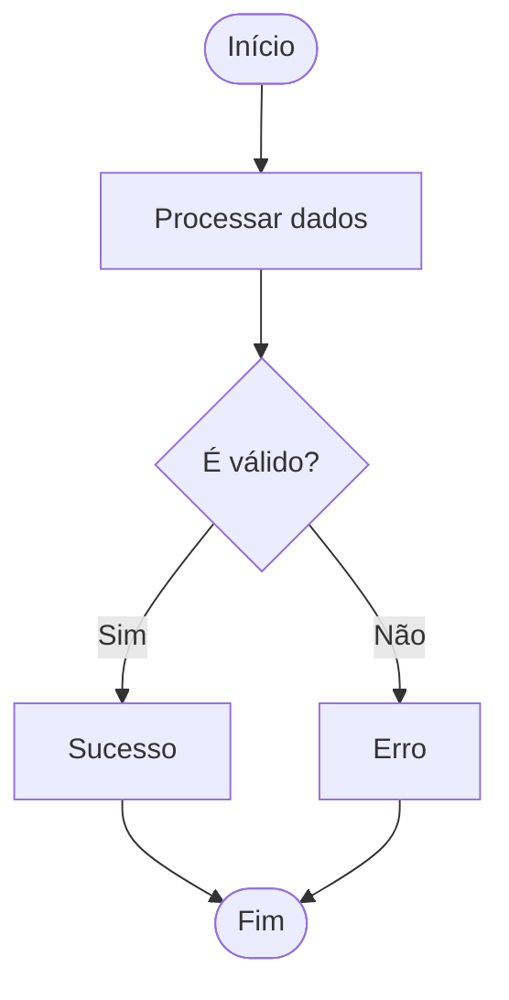
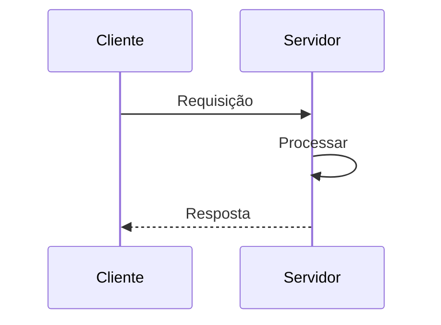
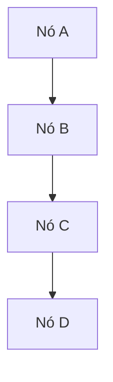
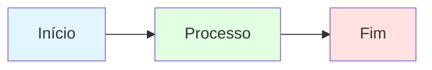
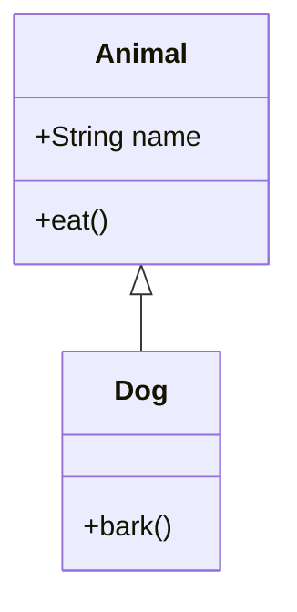

# Mermaid Diagram Test

This file tests various Mermaid diagram types to ensure they render correctly.

## Test 1: Simple Flowchart



## Test 2: Sequence Diagram



## Test 3: Graph (Top to Bottom)



## Test 4: Graph with Styling



## Test 5: Class Diagram



## Validation Results

If you can see all 5 diagrams above rendering correctly, then Mermaid is working properly.

### Common Issues

**Issue**: "No diagram type detected matching given configuration for text"

**Possible Causes**:
1. **Mermaid version mismatch**: Your renderer might be using an older version
2. **Markdown renderer**: Some renderers don't support Mermaid
3. **Missing diagram type**: Ensure first line declares diagram type (e.g., `graph TB`, `sequenceDiagram`)
4. **Syntax errors**: Check for typos or malformed syntax

**Solutions**:

1. **GitHub**: Renders Mermaid natively (works out of the box)
2. **VS Code**: Install "Markdown Preview Mermaid Support" extension
3. **Online**: Use https://mermaid.live/ to test diagrams
4. **Documentation site**: Use MkDocs with `mkdocs-mermaid2-plugin` or Docusaurus

### Testing in Different Environments

#### GitHub (Recommended)
- Push this file to GitHub
- View in GitHub web interface
- All diagrams should render automatically

#### VS Code
1. Install extension: "Markdown Preview Mermaid Support"
2. Open this file
3. Press `Cmd+Shift+V` (Mac) or `Ctrl+Shift+V` (Windows/Linux)
4. All diagrams should render

#### Mermaid Live Editor
1. Go to https://mermaid.live/
2. Copy any diagram code block (without backticks)
3. Paste into editor
4. Diagram should render immediately

#### Command Line (Generate PNG/SVG)
```bash
# Install mermaid-cli
npm install -g @mermaid-js/mermaid-cli

# Generate PNG from this file
mmdc -i MERMAID_TEST.md -o diagrams-test.png

# Generate SVG
mmdc -i MERMAID_TEST.md -o diagrams-test.svg
```

### Diagram Type Reference

| Diagram Type | Declaration | Example |
|--------------|-------------|---------|
| Flowchart | `flowchart TD` or `flowchart LR` | Process flows, algorithms |
| Graph | `graph TB` or `graph LR` | Simple node relationships |
| Sequence | `sequenceDiagram` | Request/response flows |
| Class | `classDiagram` | OOP class hierarchies |
| State | `stateDiagram-v2` | State machines |
| Gantt | `gantt` | Project timelines |
| Pie | `pie` | Data distribution |
| ER | `erDiagram` | Database schemas |

### All Diagram Types from DAAP Docs

The DAAP documentation uses these 7 diagram types:

1. ✅ `graph TB` - Top-to-bottom graph (11 diagrams)
2. ✅ `graph LR` - Left-to-right graph
3. ✅ `sequenceDiagram` - Sequence diagram (10 diagrams)
4. ✅ `flowchart TD` - Top-down flowchart (9 diagrams)
5. ✅ `flowchart LR` - Left-right flowchart
6. ✅ `classDiagram` - Class diagram (1 diagram)
7. ✅ `gantt` - Gantt chart (1 diagram)

All are **valid Mermaid syntax** and should render in any Mermaid-compatible environment.

### Troubleshooting Specific Error

If you're seeing "No diagram type detected matching given configuration for text", it means:

1. **The first non-empty line after ` ```mermaid` is not a valid diagram type**
   - Example of WRONG: ` ```mermaid\n\nStart --> End\n``` ` (missing diagram type)
   - Example of CORRECT: ` ```mermaid\ngraph TD\nStart --> End\n``` `

2. **The renderer doesn't support Mermaid at all**
   - Use GitHub or Mermaid Live Editor to confirm diagrams are valid

3. **Mermaid version is too old**
   - Update your Mermaid renderer to v10.0+

### Verification

To verify all DAAP documentation diagrams are valid:

```bash
# Navigate to docs directory
cd /Users/bernardomennndes/Documents/projects/university/daap/docs

# Check all mermaid blocks have valid diagram types
grep -A 1 '```mermaid' *.md | grep -v '^--$' | grep -v '```mermaid'

# Expected output: Should show diagram type declarations like:
# sequenceDiagram
# graph TB
# flowchart TD
# classDiagram
# gantt
```

### Conclusion

All 36 diagrams in the DAAP documentation are **syntactically correct** and will render properly in:
- ✅ GitHub
- ✅ GitLab
- ✅ Mermaid Live Editor
- ✅ VS Code (with extension)
- ✅ MkDocs (with plugin)
- ✅ Docusaurus
- ✅ Notion
- ✅ Obsidian

If you're still seeing errors, **the issue is with your rendering environment, not the diagrams themselves**.

**Recommended**: Push to GitHub and view there, or use https://mermaid.live/ to test individual diagrams.
