# DAAP Documentation

> **Comprehensive documentation for the Distributed Application Architecture Project (DAAP)**

## Overview

This documentation provides a complete guide to understanding, deploying, and extending the DAAP system - a distributed microservices architecture demonstrating intelligent cache eviction strategies with **99.9% performance improvement** over direct database queries.

### Key Innovation

- **Pluggable Eviction Strategies**: LFU, LRU, and Hybrid algorithms switchable via configuration
- **Fuzzy Cache Matching**: +35% cache hit rate improvement through query normalization and Jaccard similarity
- **Distributed Tracing**: Full OpenTelemetry instrumentation with 44 custom semantic attributes
- **Resilient Fallback**: Multi-level fallback chains ensuring high availability

### Performance Highlights

| Metric | Value |
|--------|-------|
| **Average Response Time (Cache Hit)** | 8ms |
| **Average Response Time (Cache Miss)** | 7,580ms |
| **Performance Improvement** | **99.9% faster** |
| **Cache Hit Rate** | 91% (with fuzzy matching) |
| **Eviction Latency** | 100-150ms (LFU strategy) |

---

## Documentation Structure

```mermaid
graph TB
    Index[📖 README.md<br/>Você está aqui]

    subgraph "Documentação principal"
        Arch[🏗️ 01. Architecture Overview<br/>Design do sistema & stack tecnológica]
        Flow[🔄 02. Data Flow Patterns<br/>Ciclo da requisição & fluxos de cache]
        Network[🌐 03. Network Topology<br/>Rede Docker & descoberta de serviços]
        Cache[🗂️ 04. Cache Strategies<br/>Algoritmos de eviction LFU, LRU, Hybrid]
        Observ[👁️ 05. Observability<br/>Tracing distribuído & métricas]
        Deploy[🚀 06. Deployment Guide<br/>Orquestração de containers & escala]
        Test[🧪 07. Testing Strategy<br/>Testes de carga & benchmarking]
    end

    Index --> Arch
    Index --> Flow
    Index --> Network
    Index --> Cache
    Index --> Observ
    Index --> Deploy
    Index --> Test

    Arch -.->|Referências| Flow
    Flow -.->|Referências| Network
    Network -.->|Referências| Cache
    Cache -.->|Referências| Observ
    Observ -.->|Referências| Deploy
    Deploy -.->|Referências| Test
    Test -.->|Referências| Arch

    style Index fill:#e1f5ff
    style Arch fill:#e1ffe1
    style Flow fill:#fff4e1
    style Network fill:#f4e1ff
    style Cache fill:#ffe1f4
    style Observ fill:#e1e1ff
    style Deploy fill:#ffe1e1
    style Test fill:#f4ffe1
```



---

## Quick Navigation

### 🏗️ [01. Architecture Overview](./01-architecture-overview.md)

**Start here** to understand the system design.

**Topics**:
- System architecture diagram
- Microservices inventory (Reviews, Cache, Search)
- Infrastructure components (MongoDB, Redis, Traefik, Jaeger)
- Shared packages (@daap/telemetry, @daap/schema)
- Technology stack (NestJS, MongoDB, OpenTelemetry)
- Monorepo structure (pnpm workspaces, Turborepo)

**Key Diagrams**: System architecture, service dependencies

**Audience**: Developers, architects, new team members

---

### 🔄 [02. Data Flow Patterns](./02-data-flow.md)

**Understand request lifecycle** from user to database.

**Topics**:
- Request lifecycle (cache hit vs miss)
- Cache hit flow (normalized vs fuzzy matching)
- Cache miss flow (MongoDB query + storage)
- Eviction flow (automatic after every `.set()`)
- Fallback flow (resilient error handling)
- Performance metrics (8ms vs 7580ms)

**Key Diagrams**: Sequence diagrams for cache hit/miss, fuzzy matching flowchart, eviction sequence

**Audience**: Developers, performance engineers

---

### 🌐 [03. Network Topology](./03-network-topology.md)

**Master Docker networking** and service discovery.

**Topics**:
- Docker network architecture (app_network bridge)
- Service discovery (Docker DNS)
- Port mappings (internal vs external)
- Traefik routing (host-based rules)
- Internal communication (service-to-service HTTP)
- External access (localhost, *.localhost domains)
- Network security (isolation, TLS)

**Key Diagrams**: Network topology, Traefik routing, port mappings

**Audience**: DevOps engineers, system administrators

---

### 🗂️ [04. Cache Strategies](./04-cache-strategies.md)

**Compare eviction strategies** and optimize cache performance.

**Topics**:
- Strategy architecture (pluggable design)
- LFU strategy (Least Frequently Used)
- LRU strategy (Least Recently Used)
- Hybrid strategy (weighted LFU + LRU)
- Eviction score formulas
- Strategy comparison (decision matrix)
- Configuration guide (environment variables)
- Performance analysis (hit rate vs capacity)

**Key Diagrams**: Strategy class diagram, eviction flow, score calculation examples, weight tuning flowchart

**Audience**: Cache engineers, performance engineers, researchers

---

### 👁️ [05. Observability](./05-observability.md)

**Monitor and trace** distributed requests.

**Topics**:
- OpenTelemetry architecture
- Distributed tracing (W3C Trace Context)
- Trace context propagation (HTTP headers)
- Auto-instrumentation (HTTP, MongoDB, NestJS)
- Custom spans (cache operations, eviction)
- 44 semantic attributes (cache, eviction, search, keywords)
- Jaeger integration (UI, queries, trace visualization)
- Prometheus metrics (cache hit rate, eviction duration)
- Grafana dashboards

**Key Diagrams**: OpenTelemetry architecture, trace propagation sequence, Jaeger architecture, Grafana integration

**Audience**: SRE, DevOps engineers, monitoring specialists

---

### 🚀 [06. Deployment Guide](./06-deployment.md)

**Deploy to production** with confidence.

**Topics**:
- Container orchestration (Docker Compose)
- Development deployment (quick start)
- Production deployment (checklist, configuration)
- Scaling strategy (horizontal vs vertical)
- Configuration management (secrets, environment variables)
- Health checks (Docker, Traefik)
- Monitoring & alerting (Prometheus alerts, Grafana)

**Key Diagrams**: Container orchestration, production architecture, horizontal scaling flowchart, configuration hierarchy

**Audience**: DevOps engineers, system administrators, platform engineers

---

### 🧪 [07. Testing Strategy](./07-testing.md)

**Validate performance** and compare strategies.

**Topics**:
- Testing pyramid (unit, integration, load, E2E)
- Unit testing (Jest, LFU/LRU/Hybrid tests)
- Integration testing (service-to-service, database)
- Load testing (bulk test runner, 10k+ requests)
- Strategy comparison (automated testing framework)
- K6 advanced testing (scenarios, metrics)
- Performance benchmarking (Redis vs Dragonfly, capacity testing)

**Key Diagrams**: Testing pyramid, load test flow, strategy comparison sequence, K6 scenarios

**Audience**: QA engineers, developers, performance engineers

---

## Getting Started

### Prerequisites

- **Node.js**: 18+ (LTS recommended)
- **pnpm**: 10.4.1+
- **Docker**: 20.10+ (with Docker Compose)
- **Git**: 2.30+

### Quick Start (5 minutes)

```bash
# 1. Clone repository
git clone <repo-url>
cd daap

# 2. Install dependencies
pnpm install

# 3. Setup environment
cp .env.example .env

# 4. Start infrastructure
docker-compose up -d mongodb redis traefik jaeger

# 5. Build all services
pnpm build

# 6. Start in development mode
pnpm start:dev

# 7. Test the API
curl "http://reviews.localhost/search?q=laptop&page=1&size=10"
```

**Expected Response** (first request - cache miss):
```json
{
  "items": [ /* Array of Review objects */ ],
  "total": 5432,
  "page": 1,
  "size": 10,
  "source": "search"  // First request, cache miss
}
```

**Expected Response** (second request - cache hit):
```json
{
  "items": [ /* Same array, from cache */ ],
  "total": 5432,
  "page": 1,
  "size": 10,
  "source": "cache"  // Cached! 99.9% faster
}
```

### Verify Observability Stack

```bash
# Jaeger UI (distributed tracing)
open http://localhost:16686

# Prometheus (metrics)
open http://localhost:9090

# Grafana (dashboards)
open http://localhost:3000
# Credentials: admin / admin

# Traefik Dashboard (load balancer)
open http://localhost:8080/dashboard/
```

---

## Use Cases by Role

### 👨‍💻 **I'm a Developer**

**Goal**: Understand code structure and add new features

**Start with**:
1. [Architecture Overview](./01-architecture-overview.md) - System design
2. [Data Flow Patterns](./02-data-flow.md) - Request lifecycle
3. [Network Topology](./03-network-topology.md) - Service communication

**Key Files**:
- [apps/cache-service/src/modules/cache/service.ts](../apps/cache-service/src/modules/cache/service.ts) - Cache logic with fuzzy matching
- [apps/cache-service/src/lib/cache/strategies/lfu.strategy.ts](../apps/cache-service/src/lib/cache/strategies/lfu.strategy.ts) - LFU eviction algorithm
- [packages/telemetry/src/tracer.ts](../packages/telemetry/src/tracer.ts) - OpenTelemetry tracing

---

### 🏗️ **I'm an Architect**

**Goal**: Evaluate system design and scalability

**Start with**:
1. [Architecture Overview](./01-architecture-overview.md) - High-level design
2. [Cache Strategies](./04-cache-strategies.md) - Algorithm comparison
3. [Deployment Guide](./06-deployment.md) - Scaling patterns

**Key Insights**:
- **Horizontal Scaling**: Reviews Service can scale to N instances via Traefik
- **Stateful Cache**: Cache Service cannot scale horizontally (Redis stores state)
- **Fallback Resilience**: Multi-level fallback ensures 99.9% uptime
- **Pluggable Design**: Swap eviction strategies or cache backends without code changes

---

### 🚀 **I'm a DevOps Engineer**

**Goal**: Deploy and monitor in production

**Start with**:
1. [Deployment Guide](./06-deployment.md) - Production checklist
2. [Network Topology](./03-network-topology.md) - Container networking
3. [Observability](./05-observability.md) - Monitoring setup

**Key Tasks**:
- Configure Traefik for TLS (Let's Encrypt)
- Set up MongoDB replica set
- Deploy Redis Cluster for HA
- Configure Prometheus alerts
- Set up centralized logging (ELK stack)

---

### 🧪 **I'm a QA/Performance Engineer**

**Goal**: Validate performance and compare strategies

**Start with**:
1. [Testing Strategy](./07-testing.md) - Load testing guide
2. [Cache Strategies](./04-cache-strategies.md) - Algorithm comparison
3. [Observability](./05-observability.md) - Analyzing results with Jaeger

**Key Tools**:
- **Bulk Test Runner**: [packages/tools/load-testing/](../packages/tools/load-testing/)
- **Strategy Comparison**: [packages/tools/strategy-comparison/](../packages/tools/strategy-comparison/)
- **K6 Scripts**: [packages/tools/k6/](../packages/tools/k6/)

---

### 🔬 **I'm a Researcher**

**Goal**: Understand cache eviction algorithms and performance

**Start with**:
1. [Cache Strategies](./04-cache-strategies.md) - Algorithm deep dive
2. [Data Flow Patterns](./02-data-flow.md) - Cache optimization techniques
3. [Testing Strategy](./07-testing.md) - Benchmarking methodology

**Key Metrics** (from [RESULTS.md](../RESULTS.md)):
- **LFU**: 91% hit rate, 123ms avg eviction duration
- **LRU**: 87% hit rate, 98ms avg eviction duration
- **Hybrid (0.6/0.4)**: 90% hit rate, 112ms avg eviction duration
- **Fuzzy Matching**: +35% hit rate improvement (76% → 91%)

---

## Common Tasks

### Change Eviction Strategy

```bash
# Edit .env
EVICTION_STRATEGY=hybrid
EVICTION_FREQUENCY_WEIGHT=0.6
EVICTION_RECENCY_WEIGHT=0.4

# Restart cache service
docker-compose restart cache-service

# Verify in logs
docker logs daap-cache-service | grep "Eviction Strategy"
```

**See**: [Cache Strategies - Configuration Guide](./04-cache-strategies.md#configuration-guide)

---

### Scale Reviews Service

```bash
# Scale to 8 instances
./daap.sh scale 8

# OR manually
docker-compose up -d --scale reviews-service=8

# Verify
docker ps | grep reviews-service
curl http://localhost:8080/api/http/services/reviews@docker
```

**See**: [Deployment Guide - Horizontal Scaling](./06-deployment.md#horizontal-scaling-reviews-service)

---

### Run Load Test

```bash
# Navigate to load testing directory
cd packages/tools/load-testing

# Run 10k requests with 5 concurrent connections
pnpm test:bulk 10000 5

# Results saved to results/summary-*.json
```

**See**: [Testing Strategy - Load Testing](./07-testing.md#load-testing)

---

### Compare All Eviction Strategies

```bash
# Navigate to strategy comparison directory
cd packages/tools/strategy-comparison

# Run automated comparison (tests all 3 strategies)
./run-comparison-test.sh 5000 10

# Results saved to packages/tools/results/comparison-report-*.md
```

**See**: [Testing Strategy - Strategy Comparison](./07-testing.md#strategy-comparison-testing)

---

### Analyze Traces in Jaeger

```bash
# 1. Open Jaeger UI
open http://localhost:16686

# 2. Select service: cache-service
# 3. Select operation: cache.get
# 4. Add tag filter: cache.hit_type=fuzzy
# 5. Click "Find Traces"

# Result: All fuzzy cache hits with similarity scores
```

**See**: [Observability - Jaeger Integration](./05-observability.md#jaeger-integration)

---

## Troubleshooting

### Services Not Starting

```bash
# Check Docker logs
docker-compose logs -f

# Verify environment variables
docker exec daap-cache-service env | grep EVICTION_STRATEGY

# Check health endpoints
curl http://reviews.localhost/health
curl http://cache.localhost/health
curl http://search.localhost/health
```

---

### Cache Not Working

```bash
# Verify cache service is running
docker ps | grep cache-service

# Check Redis connectivity
docker exec daap-cache-service ping redis

# View cache stats
curl http://cache.localhost/cache/stats/info
```

**See**: [Network Topology - Troubleshooting](./03-network-topology.md#troubleshooting-network-issues)

---

### Traces Not Appearing in Jaeger

```bash
# Verify Jaeger is running
docker ps | grep jaeger

# Check OpenTelemetry initialization in service logs
docker logs daap-cache-service | grep OpenTelemetry

# Verify OTLP endpoint
docker exec daap-cache-service env | grep OTEL_EXPORTER_OTLP_ENDPOINT
```

**See**: [Observability - Troubleshooting](./05-observability.md#troubleshooting)

---

## Contributing

### Adding a New Eviction Strategy

1. Create new strategy class in [apps/cache-service/src/lib/cache/strategies/](../apps/cache-service/src/lib/cache/strategies/)
2. Implement `EvictionStrategy` interface
3. Add to factory in [cache/module.ts](../apps/cache-service/src/lib/cache/module.ts)
4. Update `.env.example` with new strategy option
5. Write unit tests
6. Run strategy comparison tests

**Example**: See [Cache Strategies - Strategy Architecture](./04-cache-strategies.md#strategy-architecture)

---

### Adding a New Cache Backend

1. Create adapter in [apps/cache-service/src/lib/cache/implementations/](../apps/cache-service/src/lib/cache/implementations/)
2. Implement `CacheAdapter` interface
3. Register in [cache/module.ts](../apps/cache-service/src/lib/cache/module.ts)
4. Update `.env.example` with connection variables
5. Add health check
6. Run integration tests

**Example**: See [Architecture Overview - Adding New Cache Adapters](./01-architecture-overview.md#adding-new-cache-adapters)

---

## Glossary

| Term | Definition |
|------|------------|
| **LFU** | Least Frequently Used - evicts entries with lowest access count |
| **LRU** | Least Recently Used - evicts entries with oldest access time |
| **Hybrid** | Weighted combination of LFU and LRU |
| **Fuzzy Matching** | Jaccard similarity-based cache lookup for partial query overlap |
| **Normalized Lookup** | Cache lookup with alphabetically sorted keywords |
| **Eviction** | Process of removing cache entries to free space |
| **Trace Context** | W3C standard for propagating trace IDs across services |
| **OTLP** | OpenTelemetry Protocol - telemetry data transport protocol |
| **Semantic Attributes** | Custom metadata attached to tracing spans |
| **Jaeger** | Open-source distributed tracing system |
| **Traefik** | Cloud-native reverse proxy and load balancer |

---

## Resources

### Official Documentation

- **OpenTelemetry**: https://opentelemetry.io/docs/
- **Jaeger**: https://www.jaegertracing.io/docs/
- **NestJS**: https://docs.nestjs.com/
- **MongoDB**: https://www.mongodb.com/docs/
- **Redis**: https://redis.io/documentation
- **Traefik**: https://doc.traefik.io/traefik/

### Tools

- **K6**: https://k6.io/docs/
- **Docker Compose**: https://docs.docker.com/compose/
- **pnpm**: https://pnpm.io/
- **Turborepo**: https://turbo.build/repo/docs

---

## Support

For questions, issues, or contributions:

1. Check documentation first
2. Search existing issues
3. Create new issue with detailed description

---

## License

[MIT License](../LICENSE)

---

## Version

**Documentation Version**: 1.0.0
**Last Updated**: 2025-11-01
**DAAP Version**: 1.0.0

---

**Happy Caching!** 🚀
