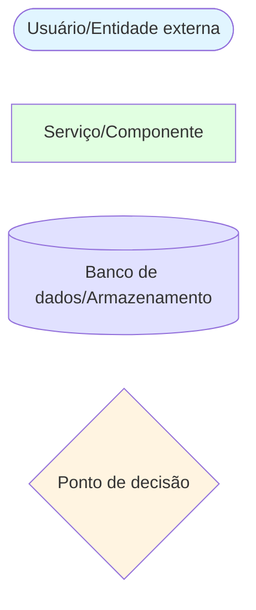

# DAAP Diagrams Index

> **Quick reference for all Mermaid diagrams in the documentation**

This document provides an index of all diagrams included in the DAAP documentation, organized by category.

## Diagram Categories

- [Architecture Diagrams](#architecture-diagrams)
- [Data Flow Diagrams](#data-flow-diagrams)
- [Network Diagrams](#network-diagrams)
- [Cache Strategy Diagrams](#cache-strategy-diagrams)
- [Observability Diagrams](#observability-diagrams)
- [Deployment Diagrams](#deployment-diagrams)
- [Testing Diagrams](#testing-diagrams)

---

## Architecture Diagrams

### System Architecture
**Location**: [01-architecture-overview.md](../01-architecture-overview.md#system-architecture)

**Type**: Graph (Multi-layer architecture)

**Shows**:
- User layer
- Load balancer (Traefik)
- Microservices (Reviews, Cache, Search)
- Data layer (MongoDB, Redis, Dragonfly)
- Observability layer (Jaeger, Prometheus, Grafana)
- Shared libraries (@daap/telemetry, @daap/schema)

**Use Case**: Understanding overall system design and component relationships

---

## Data Flow Diagrams

### 1. Request Lifecycle
**Location**: [02-data-flow.md](../02-data-flow.md#request-lifecycle)

**Type**: Sequence Diagram

**Shows**:
- User → Traefik → Reviews Service flow
- Cache hit path (8ms)
- Cache miss path (7580ms)
- Fallback path when cache service unavailable

**Use Case**: Understanding request routing and fallback strategies

---

### 2. Cache Hit Flow (Normalized)
**Location**: [02-data-flow.md](../02-data-flow.md#cache-hit-flow)

**Type**: Sequence Diagram

**Shows**:
- Query normalization process
- Cache key generation
- Redis/Dragonfly lookup
- Access recording for eviction strategy
- Jaeger span emission

**Use Case**: Debugging cache hit behavior and performance

---

### 3. Fuzzy Cache Hit Flow
**Location**: [02-data-flow.md](../02-data-flow.md#fuzzy-cache-hit-flow)

**Type**: Sequence Diagram

**Shows**:
- Keyword extraction (Porter stemmer)
- Jaccard similarity calculation
- Candidate evaluation
- Best match selection
- Tracing with similarity score

**Use Case**: Understanding fuzzy matching algorithm

---

### 4. Cache Miss Flow
**Location**: [02-data-flow.md](../02-data-flow.md#cache-miss-flow)

**Type**: Sequence Diagram

**Shows**:
- MongoDB full-text search
- Cache storage after retrieval
- Metadata registration
- Automatic eviction check
- Keyword tracking updates

**Use Case**: Understanding cache population and eviction triggers

---

### 5. Fuzzy Matching Algorithm
**Location**: [02-data-flow.md](../02-data-flow.md#fuzzy-matching-flow)

**Type**: Flowchart

**Shows**:
- Keyword extraction steps
- Similarity calculation loop
- Threshold evaluation
- Decision flow (hit vs miss)

**Use Case**: Implementing or debugging fuzzy matching logic

---

### 6. Eviction Flow
**Location**: [02-data-flow.md](../02-data-flow.md#eviction-flow)

**Type**: Sequence Diagram

**Shows**:
- Entry count check
- Metadata retrieval for all entries
- Score calculation (strategy-specific)
- Batch selection and deletion
- Keyword cleanup
- Tracing span emission

**Use Case**: Debugging eviction behavior and performance

---

## Network Diagrams

### 1. Docker Network Architecture
**Location**: [03-network-topology.md](../03-network-topology.md#docker-network-architecture)

**Type**: Graph (Layered network view)

**Shows**:
- External network (Internet/localhost)
- Docker bridge network (app_network)
- Load balancer layer (Traefik)
- Microservices layer (all services)
- Data stores (MongoDB, Redis, Dragonfly)
- Observability layer (Jaeger, Prometheus, Grafana)
- Internal vs external port mappings

**Use Case**: Understanding container networking and port exposure

---

### 2. Service Discovery Flow
**Location**: [03-network-topology.md](../03-network-topology.md#service-discovery)

**Type**: Flowchart

**Shows**:
- Application code DNS query
- Docker DNS resolver
- IP address resolution
- HTTP request establishment

**Use Case**: Debugging service-to-service communication issues

---

### 3. Port Mappings
**Location**: [03-network-topology.md](../03-network-topology.md#port-mappings)

**Type**: Graph (Host-Container port binding)

**Shows**:
- Host machine ports
- Docker container ports
- Services NOT exposed (via Traefik only)
- Port binding relationships

**Use Case**: Configuring external access and debugging port conflicts

---

### 4. Traefik Routing
**Location**: [03-network-topology.md](../03-network-topology.md#traefik-routing)

**Type**: Flowchart

**Shows**:
- User request with hostname
- Traefik router matching rules
- Load balancer (round-robin for Reviews Service)
- Routing to specific services

**Use Case**: Understanding host-based routing and load balancing

---

### 5. Internal Communication
**Location**: [03-network-topology.md](../03-network-topology.md#internal-communication)

**Type**: Sequence Diagram

**Shows**:
- Service-to-service HTTP calls
- Docker DNS resolution at each hop
- Database connections (MongoDB)
- Complete request chain

**Use Case**: Debugging inter-service communication latency

---

### 6. External Access
**Location**: [03-network-topology.md](../03-network-topology.md#external-access)

**Type**: Flowchart

**Shows**:
- User/developer access patterns
- API access via Traefik
- Direct database access
- Observability UI access

**Use Case**: Understanding how to access services from host machine

---

### 7. Network Security
**Location**: [03-network-topology.md](../03-network-topology.md#network-security)

**Type**: Graph (Security zones)

**Shows**:
- External network (untrusted)
- Traefik as single entry point
- Internal service layer (blocked from external)
- Data layer (internal only)

**Use Case**: Security architecture review

---

## Cache Strategy Diagrams

### 1. Strategy Architecture (Class Diagram)
**Location**: [04-cache-strategies.md](../04-cache-strategies.md#strategy-architecture)

**Type**: Class Diagram

**Shows**:
- EvictionStrategy interface
- BaseLFUManager abstract class
- LFUStrategy, LRUStrategy, HybridStrategy implementations
- CacheService dependency
- CacheAdapter, KeywordService, TracingService relationships

**Use Case**: Understanding pluggable strategy design pattern

---

### 2. LFU Eviction Flow
**Location**: [04-cache-strategies.md](../04-cache-strategies.md#lfu-eviction-flow)

**Type**: Sequence Diagram

**Shows**:
- Entry count check
- Metadata retrieval loop
- LFU score calculation
- Sorting and batch selection
- Deletion and cleanup
- Jaeger span emission

**Use Case**: Understanding LFU algorithm implementation

---

### 3. LFU Score Examples
**Location**: [04-cache-strategies.md](../04-cache-strategies.md#score-calculation-examples)

**Type**: Graph (Priority visualization)

**Shows**:
- High-priority entries (low score, keep)
- Medium-priority entries
- Low-priority entries (high score, evict)
- Score formula breakdown for each

**Use Case**: Tuning LFU parameters

---

### 4. LRU Score Examples
**Location**: [04-cache-strategies.md](../04-cache-strategies.md#score-calculation-examples-1)

**Type**: Graph (Priority visualization)

**Shows**:
- Recently accessed entries (low score, keep)
- Medium recency entries
- Old entries (high score, evict)
- Time-based scoring

**Use Case**: Understanding LRU behavior

---

### 5. Strategy Decision Matrix
**Location**: [04-cache-strategies.md](../04-cache-strategies.md#decision-matrix)

**Type**: Flowchart

**Shows**:
- Decision tree for choosing strategy
- Access pattern analysis
- Frequency stability check
- Configuration recommendations

**Use Case**: Selecting optimal eviction strategy

---

### 6. Hybrid Weight Tuning
**Location**: [04-cache-strategies.md](../04-cache-strategies.md#weight-tuning)

**Type**: Flowchart

**Shows**:
- Workload type analysis
- Weight configuration options
- Testing loop
- Measurement and adjustment cycle

**Use Case**: Tuning Hybrid strategy weights

---

### 7. Cache Hit Rate vs Max Entries
**Location**: [04-cache-strategies.md](../04-cache-strategies.md#cache-hit-rate-vs-max-entries)

**Type**: Graph (Performance comparison)

**Shows**:
- Small cache (500 entries): 82% hit rate
- Medium cache (1000 entries): 91% hit rate
- Large cache (2000 entries): 96% hit rate
- Diminishing returns analysis

**Use Case**: Capacity planning

---

## Observability Diagrams

### 1. OpenTelemetry Architecture
**Location**: [05-observability.md](../05-observability.md#opentelemetry-architecture)

**Type**: Graph (Multi-layer telemetry)

**Shows**:
- Microservices with SDK integration
- Telemetry package (@daap/telemetry)
- Auto-instrumentation layers
- Custom spans
- Observability backend (Jaeger, Prometheus, Grafana)

**Use Case**: Understanding telemetry flow

---

### 2. Trace Context Propagation
**Location**: [05-observability.md](../05-observability.md#trace-context-propagation)

**Type**: Sequence Diagram

**Shows**:
- Trace ID generation
- traceparent header injection
- Context extraction at each service
- Span hierarchy creation
- Jaeger span export
- Complete trace tree visualization

**Use Case**: Debugging distributed tracing issues

---

### 3. Jaeger Architecture
**Location**: [05-observability.md](../05-observability.md#jaeger-integration)

**Type**: Graph (Jaeger components)

**Shows**:
- OTLP Collector (gRPC/HTTP)
- Storage backend (in-memory or Elasticsearch)
- Query Service
- Jaeger UI
- Data flow from services to UI

**Use Case**: Understanding Jaeger deployment

---

### 4. Jaeger UI Navigation
**Location**: [05-observability.md](../05-observability.md#accessing-jaeger-ui)

**Type**: Flowchart

**Shows**:
- Search options (service, operation, tags, duration)
- Trace results list
- Trace timeline view
- Span details and attributes

**Use Case**: Learning to use Jaeger UI

---

### 5. Grafana Architecture
**Location**: [05-observability.md](../05-observability.md#grafana-dashboards)

**Type**: Graph (Data sources to dashboards)

**Shows**:
- Prometheus data source
- Jaeger data source
- InfluxDB data source (K6 metrics)
- Dashboards and alerts

**Use Case**: Setting up Grafana integration

---

## Deployment Diagrams

### 1. Container Orchestration
**Location**: [06-deployment.md](../06-deployment.md#container-orchestration)

**Type**: Graph (Docker Compose hierarchy)

**Shows**:
- docker-compose.yml configuration
- Infrastructure services
- Application services
- Shared resources (networks, volumes)
- Dependencies

**Use Case**: Understanding Docker Compose setup

---

### 2. Production Architecture
**Location**: [06-deployment.md](../06-deployment.md#production-architecture)

**Type**: Graph (Production deployment)

**Shows**:
- Internet → Cloud LB → Services
- Application tier (scaled Reviews Service)
- Data tier (MongoDB replica set, Redis cluster)
- Observability tier
- Separation of concerns

**Use Case**: Production deployment planning

---

### 3. Development Workflow
**Location**: [06-deployment.md](../06-deployment.md#development-workflow)

**Type**: Sequence Diagram

**Shows**:
- Developer editing code
- Turbo watch mode detecting changes
- Rebuild affected packages
- Hot reload in NestJS
- Using Docker infrastructure

**Use Case**: Understanding development experience

---

### 4. Horizontal Scaling Flow
**Location**: [06-deployment.md](../06-deployment.md#horizontal-scaling-reviews-service)

**Type**: Flowchart

**Shows**:
- Load monitoring
- CPU/memory checks
- Scaling decision
- Instance verification
- Traefik detection
- Traffic distribution

**Use Case**: Scaling operations

---

### 5. Configuration Hierarchy
**Location**: [06-deployment.md](../06-deployment.md#environment-variable-hierarchy)

**Type**: Flowchart

**Shows**:
- Default values in code
- .env file
- docker-compose.yml environment
- Shell environment variables
- Secrets manager
- Runtime configuration

**Use Case**: Configuration management

---

## Testing Diagrams

### 1. Testing Pyramid
**Location**: [07-testing.md](../07-testing.md#testing-pyramid)

**Type**: Graph (Test layer hierarchy)

**Shows**:
- Unit tests (80%, Jest)
- Integration tests (15%, Jest + Bulk Test Runner)
- E2E tests (5%, K6 + Strategy Comparison)
- Tool associations

**Use Case**: Understanding test strategy

---

### 2. Load Test Flow
**Location**: [07-testing.md](../07-testing.md#load-testing)

**Type**: Flowchart

**Shows**:
- Load queries dataset
- Configure test parameters
- Create worker pool
- Send concurrent requests
- Measure and record metrics
- Aggregate results
- Generate report

**Use Case**: Running load tests

---

### 3. Strategy Comparison Sequence
**Location**: [07-testing.md](../07-testing.md#strategy-comparison-testing)

**Type**: Sequence Diagram

**Shows**:
- Sequential testing of LFU, LRU, Hybrid
- Docker service restarts
- Load test execution
- Jaeger trace collection
- Metrics aggregation
- Report generation

**Use Case**: Comparing eviction strategies

---

### 4. K6 Test Scenarios
**Location**: [07-testing.md](../07-testing.md#k6-test-scenarios)

**Type**: Graph (Scenario types)

**Shows**:
- Smoke test (10 VUs, 1 min)
- Load test (50 VUs, 10 min)
- Stress test (100 VUs, 20 min)
- Spike test (500 VUs burst)
- Soak test (50 VUs, 4 hours)
- Metrics storage (InfluxDB)
- Visualization (Grafana)

**Use Case**: Advanced load testing

---

### 5. Benchmark Matrix
**Location**: [07-testing.md](../07-testing.md#performance-benchmarking)

**Type**: Graph (Variables to metrics)

**Shows**:
- Variables: Cache backend, eviction strategy, capacity, fuzzy matching
- Metrics: Hit rate, response time, eviction duration, memory, throughput
- Relationships between variables and metrics

**Use Case**: Performance benchmarking

---

## Diagram Statistics

| Category | Number of Diagrams | Primary Types |
|----------|-------------------|---------------|
| **Architecture** | 1 | Graph |
| **Data Flow** | 6 | Sequence, Flowchart |
| **Network** | 7 | Graph, Flowchart, Sequence |
| **Cache Strategies** | 7 | Class, Sequence, Graph, Flowchart |
| **Observability** | 5 | Graph, Sequence, Flowchart |
| **Deployment** | 5 | Graph, Sequence, Flowchart |
| **Testing** | 5 | Graph, Flowchart, Sequence |
| **Total** | **36** | 7 types |

---

## Diagram Legend

### Common Symbols



### Color Coding

| Color | Meaning | Example |
|-------|---------|---------|
| Light Blue (`#e1f5ff`) | User/External/Entry Point | User, Internet, Start |
| Light Green (`#e1ffe1`) | Application Services | Reviews Service, Cache Service |
| Light Yellow (`#fff4e1`) | Processing/Middleware | Traefik, Cache Operations |
| Light Purple (`#f4e1ff`) | Data/Backend | MongoDB, Search Service |
| Light Pink (`#ffe1f4`) | Cache/Storage | Redis, Dragonfly |
| Light Cyan (`#e1e1ff`) | Observability | Jaeger, Prometheus |
| Light Red (`#ffe1e1`) | Error/Low Priority | Evict, Error Handling |

---

## Mermaid Syntax Reference

All diagrams use **Mermaid** syntax, which can be rendered in:

- GitHub README.md files
- Markdown editors (VS Code with Mermaid extension)
- Documentation sites (GitBook, Docusaurus, MkDocs)
- Mermaid Live Editor: https://mermaid.live/

### Common Diagram Types

```markdown
# Fluxograma
graph TD
    A[Início] --> B{Decisão}
    B -->|Sim| C[Ação]
    B -->|Não| D[Fim]

# Diagrama de sequência
sequenceDiagram
    User->>Service: Requisição
    Service->>Database: Consulta
    Database-->>Service: Dados
    Service-->>User: Resposta

# Diagrama de classes
classDiagram
    class Animal {
        +name: string
        +eat()
    }
    class Dog {
        +bark()
    }
    Animal <|-- Dog

# Grafo (multidirecional)
graph TB
    A[Nó A] --> B[Nó B]
    A --> C[Nó C]
    B --> D[Nó D]
```

---

## Updating Diagrams

To update any diagram:

1. Locate the diagram in the source markdown file (see "Location" in each section above)
2. Edit the Mermaid code block
3. Test in Mermaid Live Editor if needed
4. Ensure color coding follows the legend
5. Update this index if adding/removing diagrams

---

## Generating Images

To generate PNG/SVG images from Mermaid diagrams:

```bash
# Install mermaid-cli
npm install -g @mermaid-js/mermaid-cli

# Generate PNG
mmdc -i diagram.md -o diagram.png

# Generate SVG
mmdc -i diagram.md -o diagram.svg -b transparent
```

---

**Total Diagrams**: 36
**Last Updated**: 2025-11-01
**Documentation Version**: 1.0.0
